# Computer Systems A Programmer's Perspective Third Edition

## Chapter one: A Tour Of Computer Systems

* In different contexts, the same sequence of bytes might represent an integer, , floating-point number ,or machine WX20190512-201104@2x.png

* C is the language of choice for system-level programming

* the compilation system:

  <div align="center">  </div><br>

* the include command tells the preprocessor to read the contents of the system header file stdio.h and insert it into the program text
* The buses are typically designed to transfer fixed-size chunks of bytes known as words
* Main memory consists of a collection of dynamic random access memory
* Each IO devices is connected to the IO bus by either a controller or an adapter, the distinction between the two is mainly one of packaging, controllers are chip sets in the device itself or on the system's motherboard, an adapter is a card that plugs into a slow on the motherboard
* the idea behind caching is that a system can get the effect of both a very large memory and a very fast one by exploit locality
* the register file is a cache for the L1 cache, Caches L1 and L2 are caches for L2 and L3
* the operating system as a layer of software interposed between the application programs and the hardware
* operating system:
  * to protect the hardware from misuse by runaway applications
  * to provide applications with simple and uniform mechanisms for manipulating complicated and often wildly different low-level hardware devices

* files are abstractions for IO devices, VM is an abstraction for both the main memory and disk IO devices, and processes are abstractions for the processor, main memory and IO devices
* the operating system performs this interleaving with a mechanism known as context switching
* the kernel is the portion of the operating system code that is always resident in memory
* Kernel is code and data structures that the system uses to manage all the processes
* the process virtual address

<div align="center">  </div><br>

* application programs are not allowed to read or write the contents of this area or to directly call functions defined in the kernel code
* The basic idea is to store the contents of a process's virtual memory on disk and then use the main memory as a cache for the disk
* Amdahl's Law: S = 1 / ((1- alpha) + alpha/k), alpha is the portion and k is the spped up times
* The term parallelism to refer to the use of concurrency to make a system run faster
* Hyper threading, called simultaneous multi-threading, is a technique that allows a single CPU to execute multiple flows of controls
* a hyper threaded processor decides which of its threads to execute on a cycle-by-cycle basis
* More recent processors can sustain execution rates of 2-4 instructions per cllock cycle
* On the processor side, the instruction set architecture provides an abstractions of the actual processor hardware
* SIMD, single-instruction multiple data parallelism


## Chapter two Representing and manipulating information

* The electronic circuitry for storing and performing computations on two-valued signals is very simple

* Floating-point encodings are a base-2 version of scientific notation for representing real numbers

* the C standards are designed to allow a wide range of implementations, the java standard is quite specific on the formats and encodings of Java

* C standard: --std=c11, --std=c99, --ansi, --std=c89

* every computer has a word size, indicating the nominal size of pointer data, since a virtual address is encoded by such a word, the most important system parameter determined by the word size is the maximum size of the virtual address space

* compile you can use -m32 to generate program for 32 or 64 bit machine, or -m64 just for 64-bit machine

* ISO C99 introduce a class of data types where the data sizes are fixed regardless of compiler and machine settings

* char type, most compilers treat these as signed data, the C standard does not guarantee this, it is best to use signed char

* a multi-byte object is stored as a contiguous sequence of bytes, with the address of the object given by the smallest address of the bytes used

* The least significant byte comes first, is referred to as little-endian

* byte ordering becomes an issue, when binary data are communicated over a network between different machines

* size_t is the preferred data type for expressing the sizes of the data structures

* we can dereference a pointer with array notation, we can reference array elements with pointer notation.

* the ASCII code for decimal digit x happens to be 0x3x, text data are more platform independent than binary data

* the letters 'a' through 'z' have ascii codes 0x61 through 0x7A

* the strlen does not count the terminating null character in C

* Binary code is seldom portable across different combinations of machine and operating system

* (a ^ b) ^ a = b , exclusive or

* almost all compiler combinations use arithmetic right shifts for signed data

* for unsigned data, on the other hand, right shifts must be logical

* Java supports only signed numbers

* . Consider the comparison -1 < 0U. Since the second operand is unsigned, the first one is implicitly cast to unsigned, and hence the expression is equivalent to the comparison 4294967295U < 0U

* **#define INT_MIN (-INT_MAX - 1)**, the asymmetry of the two's complement representation and the conversion rules of C forces us to write in this unusual way

* sign extension preserves the value of a two's complement number

* when converting from short to unsigned, the program first changes the size and then the type

* the addition sum overflow, if and only if s < x, or s < y

* for x and y in the range TMinw<=x, y <=TMaxw, then the computation of s has had positive overflow if and only if x > 0 and y > 0 but s <= 0, the computation has had negative overflow if and only if x < 0 and y < 0 but s >= 0

* Expression (x+y) -x will evaluate to y regardless of whether or not the addition overflows and that (x+y)-y will always evaluate to x

* with 64 bits, we can perform the multiplication without overflowing, we then test whether casting the product to 32 bits change the value

* test whether x *y overflow:  return !x || p / x == y

* FormA: (x<<n)+(x<<(n−1))+...+(x<<m)
  Form B: (x<<(n + 1)) - (x<<m) 

  using shifts to replace multiplication when multiplied by a constant, n >>m, is a running sequences of ones

* dividing two's complement numbers by powers of 2, by adding a bias before the right shift, the result is rounded toward zero

* unlike multiplication, we cannot express division by arbitrary constant K interms of division by powers of 2

* the formula below compute the value x/2^k

* ```
  (x<0 ? x+(1<<k)-1 : x) >> k
  ```

* V = (-1) ^s  * M * 2 ^E, floating-point numbers are represented by three fields

* with IEEE floating-point format, the values -0.0 and +0.0 are considered different in some ways and the same in others

* a second function of denormalized numbers is to represent numbers that are very close to 0.0 they provide a property known as gradual underflow

* the lack of associativity in floating-point addition is the most important group property that is lacking

* (3.14+1e10)-1e10 evaluates to 0.0

* the expression (int) 1e10 yields -21483648

* intel-compatible microprocessors designate the bit pattern as an integer indefinite value


## Chapter 3 Machine language

* the GCC C compiler generates its output in the form of assembly code, a textual representation of the machine code giving the individual instructions in the program

* assembly code is highly machine specific

* Introduced AVX, an extension of the SSE to support data packed into 256-bit vectors

* Gcc -Og -o p p1.c p2.c, the command-line option -Og instructs the compiler to apply a level of optimization that yields machine code that follows the overall structure of the original C code

* the format and behavior of a machine-level program is defined by the ISA, defining the processor state, the format of the instruction set architecture or ISA

* the program counter referred to as the PC, and called %rip in x86-64 

* X86-64 instructions can range in length from 1 to 15 bytes the instruction encoding is designed so that commonly used instructions and those with fewer operands require a smaller number of bytes than do less common ones or ones with more operands

* all the lines beginning with '.' directives to guide the assembler and linker

* assembly code format: ATT, intel two formats

* the stack pointer %rsp, used to indicate the end position in the run-time stack

* any instruction that generates a 32-bit value for a register also sets th high-order portion of the register to 0

* dereferencing a pointer involves copying that pointer into a register and then using this register in a memory reference

* Local variables such as x are often kept in registers rather than stored in memory location

* with x86-64, the program stack is stored in some region of memory

* the ability of the **leaq** instruction to perform addition and limited forms of multiplication proves useful when compiling simple arithmetic expressions such as this example

* the different shift instructions can specify the shift amount either as an immediate value or with the single-byte register

* Flags in ALU: Carry flag, Zero flag, Sign flag, Overflow flag

* Conditional jumps can only be direct

* by using a PC-relative encoding of the jump targets, the instructions can be compactly encoded 

* Before shifting by k = 4, we must add a bias of 2k - 1 =15 when the dividend is negative

* we can test for overflow by computing x/n and seeing whether it equals x/n = (n-1)!

* switch: allow an efficient implementation using a data structure called a jump table

* stack frame

* <div align="center"> 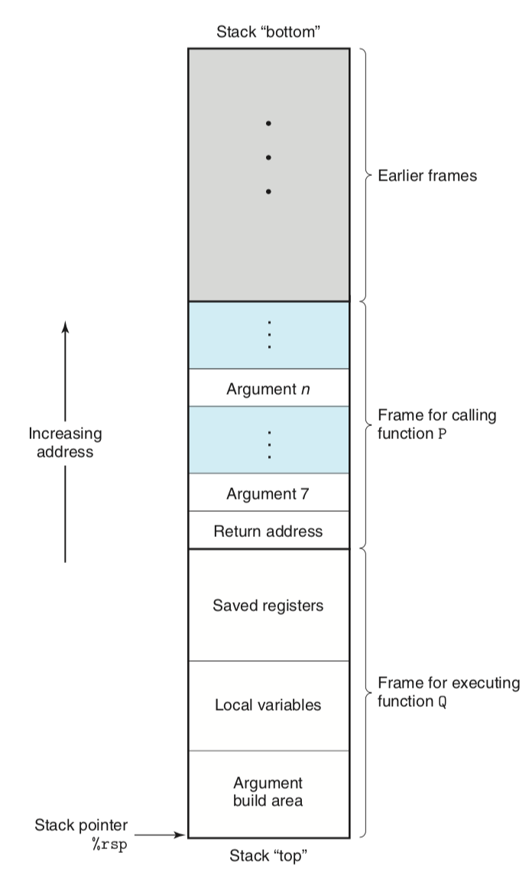 </div><br>

* many functions do not even require a stack frame, this occurs when all of the local variables can be held in registers and the function does not call any other functions

*  register for passing function arguments

* <div align="center"> 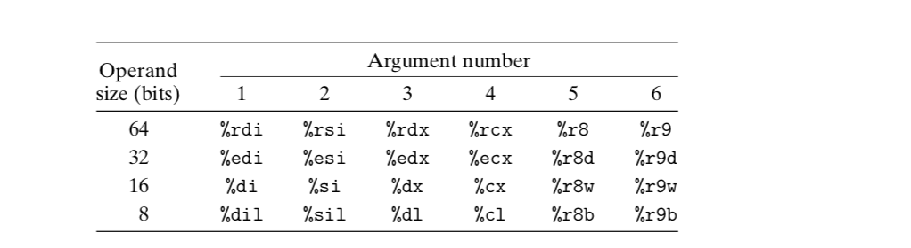 </div><br>

* The stack frame for most functions must be aligned on a 16-byte boundary

* Pointer types are not part of machine code, they are abstraction provided by C to help programmers avoid addressing errors

* Casting has higher precedence than additions

* The value of a function pointer is the address of the first instruction in the machine-code representation of the function, int (* f) (int *)

* Worm: a program that can run by itself and can propagate a fully working version of itself to other machines, virus: a piece of code that adds itself to other programs, including operating system

* the idea of stack randomization is to make the position of the stack vary from one run of a program to another

* %fs:40 is an indication that the canary value is read from memory using segmented addressing

* Read, reading data from memory, write, storing data into memory, execute treating the memory contents as machine-level code

* the virtual memory space is logically divided into pages, typically with 2048 or 4096 bytes per page

* AVX floating-point operations cannot have immediate values as operands, the compiler must allocate and initialize storage for any constant valuess

*  Alternatively, an approach known as *just-in-time compilation* dynamically translates byte code sequences into machine instructions.

## Chapter four Processor Architecture

* there are many different models of processors within a single family, each manufacturer produces processors of ever-growing performance and complexity but the different models remain compatible at the ISA level
* one important property of any instruction set is that the byte encodings must have a unique interpretation, an arbitrary sequence of bytes encodes a unique instruction is not a legal byte sequence
* the core of RISC design is an instruction set that is well suited to execution on a pipelined machine
* A simpler instruction set could be implemented with much less hardware and could be organized in an efficient pipeline structure, similar to those described later in this chapter
* working out details in advance and striving for complete consistency can save a lot of trouble in the long run
* In machine-level programming, the registers represent a small collection of addressable words in the CPU, where the addresses consist of register IDs
* In hardware, a register is directly connected to the rest of the circuit by its input and output
  wires.
* we will see that the hardware can sometimes pass a word directly from one instruction to another to avoid delay of first writing and then reading the register file
* processor stages: **fetch->decode(read values from registers)->execute(ALU operations)->memory->write back->PC update**
* A key feature of pipelining is that it increases the throughput of the system, but it may slightly increase the latency
* we could have disastrous effects if the clock were run too fast, the values would not have time to propagate through the combinational logic
* Devising a partitioning of the system computation into a series of stages having uniform delays can be a major challenge for hardware designers
* This feedback brings the updated register values down to the register file and the new PC value down to the PC register

* A Sequential implementation

<div align="center"> 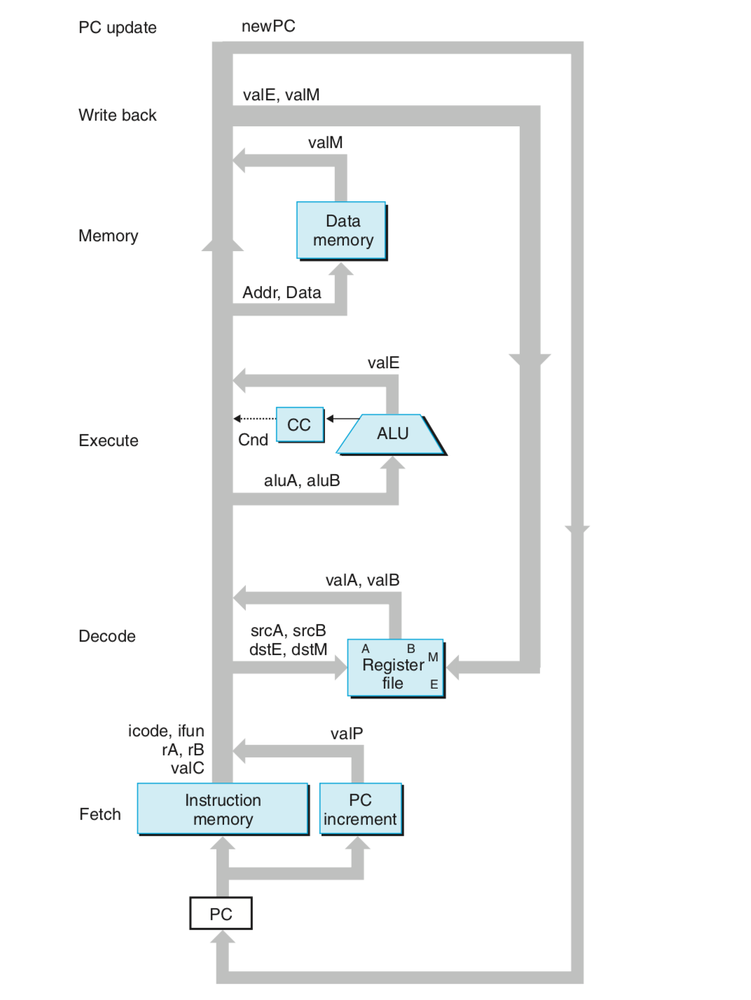 </div><br>

* No reading back: The processor never needs to read back the state updated by an instruction in order to complete the processing of this instruction
* Retiming changes the state representation for a system without changing its logical behavior
* data hazards occur because our pipelined processor reads the operands for an instruction from the register file in the decode stage but does not write the results for the instruction to the register file until three cycles later, after the instruction passes through the write-back stage


## Chapter 5 Optimizing Program Performance

* if a compiler cannot determine whether or not two pointers may be aliased, it must assume that either case is possible, limiting the set if possible optimizations
* if a function call has been optimized away via inline substitution, then any attempt to trace or set a breakpoint for that call will fail
* the latency bound is encountered when a series of operations must be performed in strict sequence, because the result of one operation is required before the next one can begin
* the throughput bound characterizes the raw computing capacity of the processor's functional units
* since the critical path was the limiting factor for the performance of the code without loop unrolling, it remains so with k * 1 loop unrolling
* Most compilers will not attempt any reassiciations of floating-point operations, since these operations are not guaranteed to be associative
* modern processors have considerable amounts of computing power, but we may need to coax this power out of them by writing our programs in very stylized ways
* the additional computation required to preform bounds checking can take place in parallel with the combining operations
* modern processors have dedicated functional units to perform load and store operations, and these units have internal buffers to hold sets of outstanding requests for memory operations
* Unix systems provide the profiling program GPROF
* The program must be compiled and linked for profiling, with GCC, this involves simply including the run-time flag -pg on the command line
* It is based on a simple *interval counting* scheme in which the compiled program maintains a counter for each function record- ing the time spent executing that function gp
* gprof is invoked to analyze the data in gmon.out:  linux> *gprof prog* 
* More sophisticated profilers are available, such as the vtune program development system from In-
  tel, and valgrind, commonly available on Linux systems


## Chapter 6 Memory

* A memory system is a hierarchy of storage devices with different capacities, costs, and access times

* If the data your program needs are stored in a CPU register, then they can be accessed in 0 cycles during the execution of the instruction. If stored in a cache, 4 to 75 cycles. If stored in main memory, hundreds of cycles. And if stored in disk, tens of millions of cycles

* Static RAM (SRAM) is faster and significantly more expensive than *dynamic*

* SRAM is used for cache memories, both on and off the CPU chip. DRAM is used for the main memory plus the frame buffer of a graphics system

* Due to its bistable nature, an SRAM memory cell will retain its value indefinitely, as long as it is kept powered.

* 

* <div align="center"> 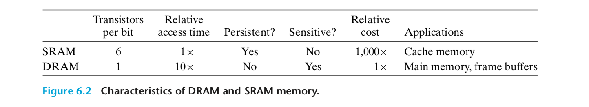 </div><br>

* The memory system must periodically refresh every bit of memory by reading it out and then rewriting it. Some systems also use error-correcting codes, where the computer words are encoded using a few more bits

* 

* <div align="center"> 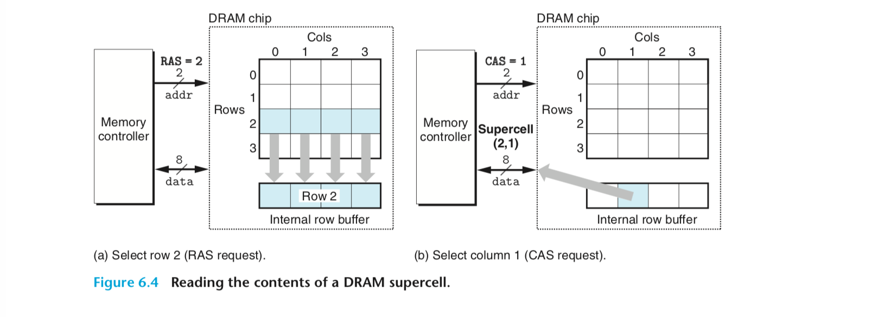 </div><br>

* Fast page mode DRAM: To read supercells from the same row of an FPM DRAM, the memory controller sends an initial RAS/CAS request, followed by three CAS requests.

* Synchronous DRAM: replaces many of these control signals with the rising edges of the same external clock signal that drives the memory controller

* Double Data-Rate Synchronous DRAM. DDR SDRAM is an enhancement of SDRAM that doubles the speed of the DRAM by using both clock edges as control signals

* VRAM allows concurrent reads and writes to the memory

* Nonvolatile memories, for historical reasons, they are referred to collectively as read-only memories, even though some types of ROMs can be written to as well as read

* PROM, programmable ROM, EPROM, erasable programmable ROM, electrically erasable PROM

* Programs stored in ROM devices are often referred to as firmware. When a computer system is powered up, it run firmware stored in a ROM

* a bus is a collection of parallel wires that carry address, data and control signals

* The I/O bridge translates the electrical signals of the system bus into the electrical signals of the memory bus

* Circuitry on the CPU chip called the bus interface initiates a read transaction on the bus

* 

* <div align="center"> 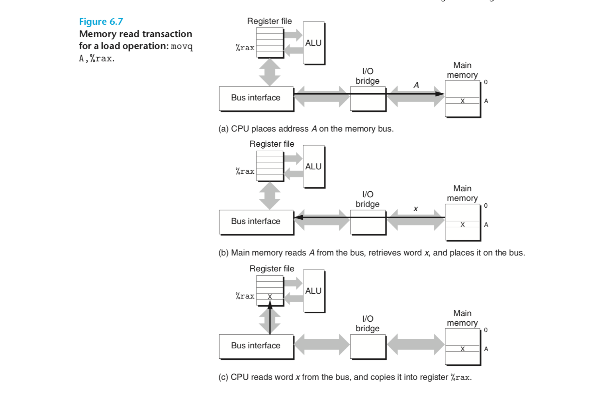 </div><br>

* Disk is like 

* <div align="center"> 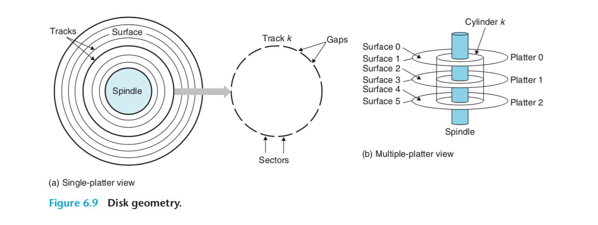 </div><br>

* the drive can position the head over any track on the surface, the machnical motion is known as a seek

* disk time, the time to access the 512 bytes in a disk sector is dominated by the seek time and the rotational latency. Accessing the first byte in the sector taks a long time, but the remaing bytes are essentially free

* ```mathematica
  Taccess = Tavg seek + Tavg rotation + Tavg transfer
  
  = 9 ms + 4 ms + 0.02 ms 
  
  = 13.02 ms 
  ```

* disk controller maintains the mapping between logical block numbers and actual disk sectors

* The *formatted capacity* quoted by disk manufacturers is less than the maximum capacity because
  of the existence of these spare cylinders

* IO devices such as graphics cards, monitors,  are connected to the CPU and main memory using an IO bus

* a host bus adapter that connects one or more disk to the IO bus using a communication protocol defined by a particular host bus interface

* A PCIe bus, with a maximum throughput of 16 GB/s, is an order of magnitude faster than a PCI bus, which has a maximum throughput of 533 MB/s

* Reading a disk sector

* <div align="center"> 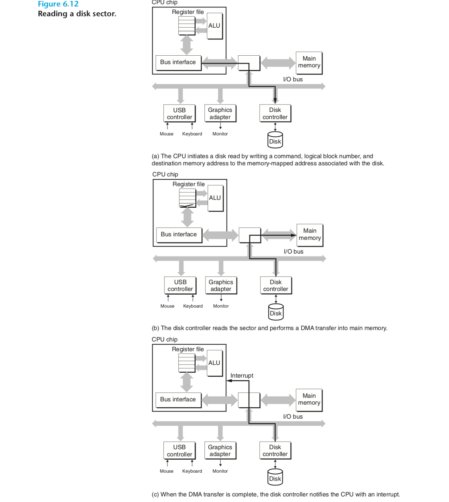 </div><br>

* An SSD package consists of one or more flask memory chips which replace the mechanical drive in a conventional rotating disk and a flash translation layer, which is a hardware/firmware device that plays the same role as a disk controller.

* a page can be written only after the entire block to which it belongs has been erased

* modern computers make heavy use of SRAM-based caches to try to bridge the processor–memory gap. This approach works because of a fundamental property of application programs known as *locality*

* Locality is typically described as having two distinct forms: temporal locality and spatical locality

* In other words, each level in the hierarchy cahces data objects from the next lower level

* It is important to realize that while the block size is fixed between any particular pair of adjacent levels in the hierarchy, other pairs of levels can have different block sizes

* Restrictive placement policies of this kind lead to a type of miss known as a *conflict miss*

* when the size of the working set exceeds the size of the cache, the cache will experience what are known as capacity misses

* General organization of a cache

* <div align="center"> 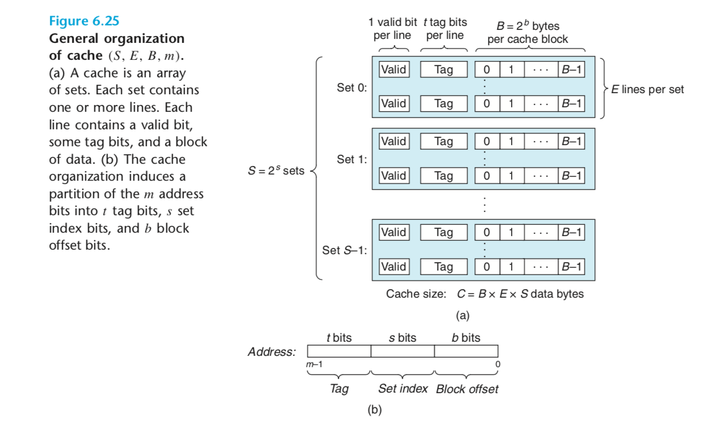 </div><br>

* Another approach, known as write-back, defers the updates as long as possible by writing the updated block to the next lower level only when it is edited from the cache by the replacement algorithm.
* the simplest approach known as write-through, is to immediately write w's cache block.
* a large cache will tend to increase the hit rate, as a result, larger caches tend to increase the hit time
* High-performace systems that pushed the clock rates would opt for smaller associativity for L1 caches and a higher degree of associativity for the lower levels, where the miss penalty is higher
* caches at all levels of the memory hierarchy store data as contiguous blocks
* Code misses sometimes are unavoidable
* The aim is to exploit temporal locality so that heavily used words are fetched from the L1 cache, and to exploit spatial locality so that as many words as possible are accessed from a single L1 cache line.


## Chapter 7 Linking

* When we change one of these modules, we simply recompile it and relink the application

* linking is the process of collecting and combining various pieces of code and data into a single file that can be loaded into memory and executed.

* the generate object file process

* <div align="center"> 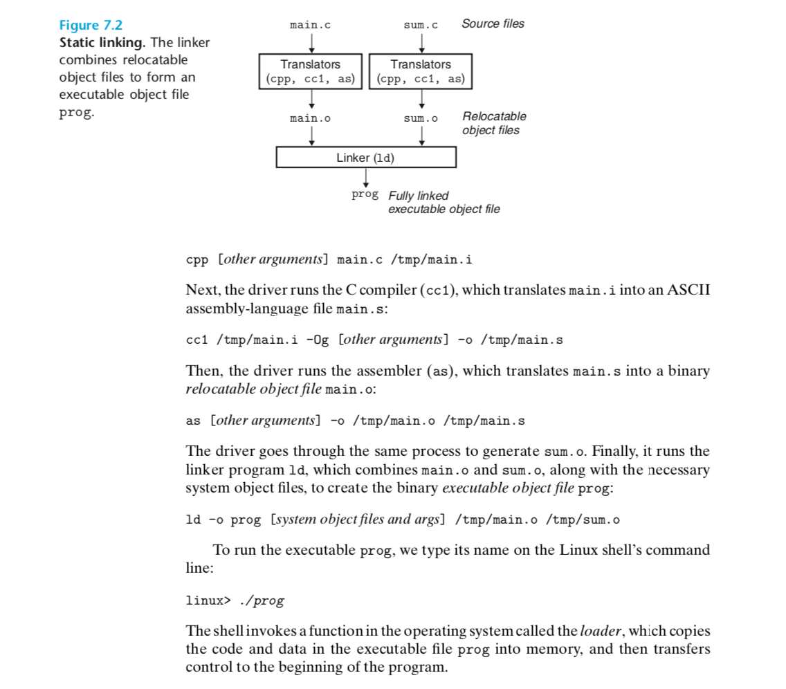 </div><br>

* linker

  * symbol resolution: The purpose of symbol resolution is to associate each symbol *reference* with exactly one symbol *definition*
  * Compilers and assemblers generate code and data sections that start at address 0.

* Object files:

  * Relocatable object file. Contains binary code and data in a form that can be combined with other relocatable object files at compile time to create an executable object file. 

  * Executable object file. Contains binary code and data in a form that can be copied directly into memory and executed. 

  * Shared object file. A special type of relocatable object file that can be loaded into memory and linked dynamically, at either load time or run time. 

*  Windows: Portable Executable Format, Mac: Mach-O format, linux: Executable and linkable Format

* <div align="center"> 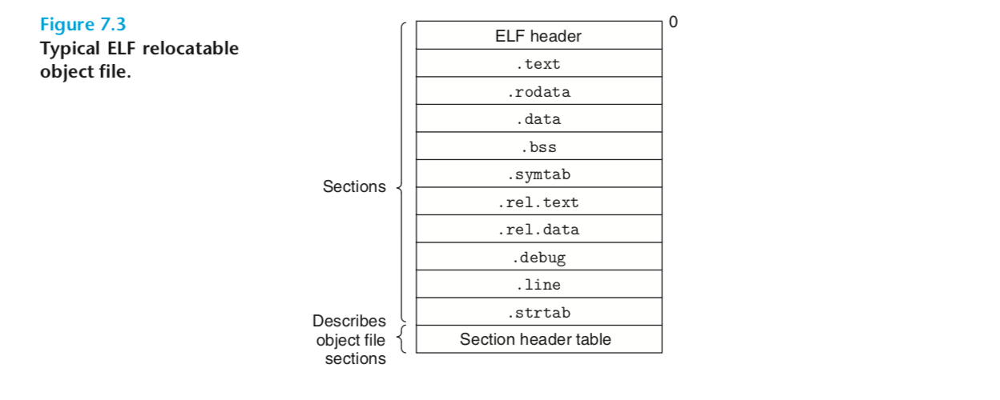 </div><br>

* .text The machine code of the compiled program.
   .rodata Read-only data such as the format strings in printf statements, and 

  jump tables for switch statements. 

  .data *Initialized*globalandstaticCvariables.LocalCvariablesaremaintained at run time on the stack and do *not* appear in either the .data or .bss sections. 

  .bss *Uninitialized* global and static C variables, along with any global or static variables that are initialized to zero. This section occupies no actual space in the object file; it is merely a placeholder. Object file formats distinguish between initialized and uninitialized variables for space efficiency: unini- tialized variables do not have to occupy any actual disk space in the object file. At run time, these variables are allocated in memory with an initial value of zero. 

  .symtab A*symboltable*withinformationaboutfunctionsandglobalvariables that are defined and referenced in the program. Some programmers mis- takenly believe that a program must be compiled with the -g option to get symbol table information. In fact, every relocatable object file has a symbol table in .symtab (unless the programmer has specifically re- moved it with the strip command). However, unlike the symbol table inside a compiler, the .symtab symbol table does not contain entries for local variables. 

  .rel.text Alistoflocationsinthe.textsectionthatwillneedtobemodified when the linker combines this object file with others. In general, any instruction that calls an external function or references a global variable will need to be modified. On the other hand, instructions that call local functions do not need to be modified. Note that relocation information is not needed in executable object files, and is usually omitted unless the user explicitly instructs the linker to include it. 

  .rel.data Relocationinformationforanyglobalvariablesthatarereferenced or defined by the module. In general, any initialized global variable whose initial value is the address of a global variable or externally defined func- tion will need to be modified. 

  .debug A debugging symbol table with entries for local variables and typedefs defined in the program, global variables defined and referenced in the program, and the original C source file. It is only present if the compiler driver is invoked with the -g option. 

  .line A mapping between line numbers in the original C source program and machine code instructions in the .text section. It is only present if the compiler driver is invoked with the -g option. 

  .strtab A string table for the symbol tables in the .symtab and .debug sec- tions and for the section names in the section headers. A string table is a sequence of null-terminated character strings. 

* uninitialized variables do not have to occupy any actual disk space in the object file, at run time, these variables are allocated in memory with an initial value of zero

  * Symbol tables are built by assemblers, using symbols exported by the compiler into the assembly-language .s file

* When the complier encounters a symbol, that is not defined, it will generates a linker symbol table entry, and leaves it for the linker to handle

* Both C++ and Java allow overloaded methods that have the same name in the source code but different parameter lists

* Rule 1. Multiple strong symbols with the same name are not allowed. 

  Rule2. Givenastrongsymbolandmultipleweaksymbolswiththesamename, choose the strong symbol. 

  Rule 3. Given multiple weak symbols with the same name, choose any of the weak symbols. 

* when in doubt, invoke the linker with  a flag such as the GCC -fno-common flag, which triggers an error if it encounters multiply-defined global symbols, or use the -Werror option, which turns allwarnings into errors

* the compiler assigns x to COMMON, when a weak symbol is encountered

*  static library, related functions can be compiled into separate object modules and then packaged in a single static library file

* create static library:

  ```bash
  linux> gcc -c addvec.c multvec.c
  linux> ar rcs libvector.a addvec.o multvec.o
  linux> gcc -c main2.c
  linux> gcc -static -o prog2c main2.o ./libvector.a
  linux> gcc -c main2.c
  linux> gcc -static -o prog2c main2.o -L. -lvector
  ```

* Once the linker has completed the symbol resolution step, it has associated each
  symbol reference in the code with exactly one symbol definition, it merges the int modules and assigns run-time addresses to each symbol

* virtual memory is organized as large contiguous power-of-2 chunks of bytes

* For any segment s, the linker must choose a starting address, vaddr, such that 

  ​	vaddr mod align = off mod align 

  where off is the offset of the segment’s first section in the object file 

* the running time stack

* <div align="center"> 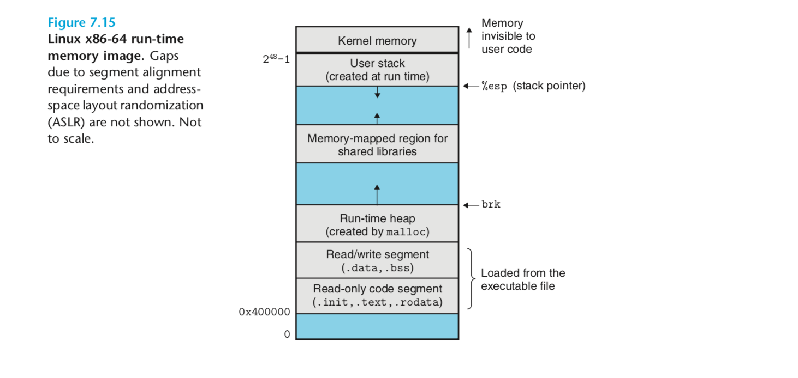 </div><br>

* code and data segments to memory->the loader jumps to the program's entry point, whichis always the address of the _start function -> the _start function calls the system startup function, __libc_start_main which is defined in libc.so

* shared libraries are modern innovations that address the disadvantages of static libraries, a shared library is an object module that, at either run time or load time, can be loaded at an arbitrary memory address and linked with a program in memory

* a single copy of the .text section of a shared library in memory can be shared by different running processes

* The -fpic flag directs the compiler to generate *position-independent code* (more on this in the next section). 

* ```bash
  linux> *gcc -shared -fpic -o libvector.so addvec.c multvec.c* 
  ```

* the linker copies some relocation and symbol table information that will allow references to code and data in libvector.so to be resolved at load time

* When a request arrives from a Web browser, the server dynamically loads and links the appropriate function and then calls it directly, 

* 

* ```
  linux> gcc -rdynamic -o prog2r dll.c -ldl
  ```

* At load time, the dynamic linker relocates each GOT entry so that it contains absolute address of the object

* Lazy binding is implemented with a compact yet somewhat complex interac-
  tion between two data structures: the GOT and the *procedure linkage table (PLT)*.

* Interpositioning can occur at compile time, link time, or run time as the
  program is being loaded and executed

* Compile-Time Interpositioning

* ```
  linux> gcc -DCOMPILETIME -c mymalloc.c linux> gcc -I. -o intc int.c mymalloc.o
  ```

* Link-Time Interpositioning , The Linux static linker supports link-time interpositioning with the --wrap f flag. This flag tells the linker to resolve references to symbol f as __wrap_f (two
  underscores for the prefix), and to resolve references to symbol __real_f
  (two underscores for the prefix) as f

* ```
  linux> gcc -DLINKTIME -c mymalloc.c 
  linux> gcc -c int.c
  linux> gcc -Wl,--wrap,malloc -Wl,--wrap,free -o intl int.o mymalloc.o
  ```

* The run-time interpositioning

* ```bash
  linux> gcc -DRUNTIME -shared -fpic -o mymalloc.so mymalloc.c -ldl
  linux> gcc -o intr int.c
  ```

* the LD_PRELOAD environtment variable is set to a list of shared library pathnames, when you load and execute a program, the dynamic linker will search the LD_PRELOAD libraries first, before any other shared libraries, when it resolves undefined references

* ```
  
  ar. Creates static libraries, and inserts, deletes, lists, and extracts members.
  
  strings. Lists all of the printable strings contained in an object file.
  
  strip. Deletes symbol table information from an object file.
  
  nm. Lists the symbols defined in the symbol table of an object file.
  size. Lists the names and sizes of the sections in an object file.
  
  readelf. Displays the complete structure of an object file, including all of the information encoded in the ELF header. Subsumes the functionality of size and nm.
  
  objdump. Themotherofallbinarytools.Candisplayalloftheinformationinan object file. Its most useful function is disassembling the binary instructions in the .text section.
  
  Linux systems also provide the ldd program for manipulating shared libraries: 
  ldd: Lists the shared libraries that an executable needs at run time.
  ```


## Chapter 8


