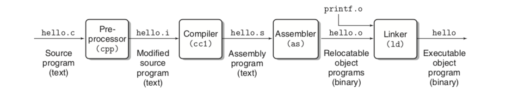
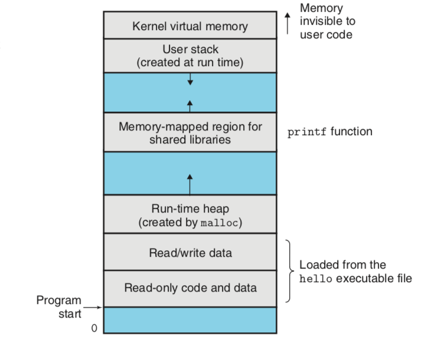

# Computer Systems A Programmer's Perspective Third Edition

## Chapter one: A Tour Of Computer Systems

* In different contexts, the same sequence of bytes might represent an integer, , floating-point number ,or machine WX20190512-201104@2x.png

* C is the language of choice for system-level programming

* the compilation system:

  <div align="center">  </div><br>

* the include command tells the preprocessor to read the contents of the system header file stdio.h and insert it into the program text
* The buses are typically designed to transfer fixed-size chunks of bytes known as words
* Main memory consists of a collection of dynamic random access memory
* Each IO devices is connected to the IO bus by either a controller or an adapter, the distinction between the two is mainly one of packaging, controllers are chip sets in the device itself or on the system's motherboard, an adapter is a card that plugs into a slow on the motherboard
* the idea behind caching is that a system can get the effect of both a very large memory and a very fast one by exploit locality
* the register file is a cache for the L1 cache, Caches L1 and L2 are caches for L2 and L3
* the operating system as a layer of software interposed between the application programs and the hardware
* operating system:
  * to protect the hardware from misuse by runaway applications
  * to provide applications with simple and uniform mechanisms for manipulating complicated and often wildly different low-level hardware devices

* files are abstractions for IO devices, VM is an abstraction for both the main memory and disk IO devices, and processes are abstractions for the processor, main memory and IO devices
* the operating system performs this interleaving with a mechanism known as context switching
* the kernel is the portion of the operating system code that is always resident in memory
* Kernel is code and data structures that the system uses to manage all the processes
* the process virtual address

<div align="center">  </div><br>

* application programs are not allowed to read or write the contents of this area or to directly call functions defined in the kernel code
* The basic idea is to store the contents of a process's virtual memory on disk and then use the main memory as a cache for the disk
* Amdahl's Law: S = 1 / ((1- alpha) + alpha/k), alpha is the portion and k is the spped up times
* The term parallelism to refer to the use of concurrency to make a system run faster
* Hyper threading, called simultaneous multi-threading, is a technique that allows a single CPU to execute multiple flows of controls
* a hyper threaded processor decides which of its threads to execute on a cycle-by-cycle basis
* More recent processors can sustain execution rates of 2-4 instructions per cllock cycle
* On the processor side, the instruction set architecture provides an abstractions of the actual processor hardware
* SIMD, single-instruction multiple data parallelism


## Chapter two Representing and manipulating information

* The electronic circuitry for storing and performing computations on two-valued signals is very simple

* Floating-point encodings are a base-2 version of scientific notation for representing real numbers

* the C standards are designed to allow a wide range of implementations, the java standard is quite specific on the formats and encodings of Java

* C standard: --std=c11, --std=c99, --ansi, --std=c89

* every computer has a word size, indicating the nominal size of pointer data, since a virtual address is encoded by such a word, the most important system parameter determined by the word size is the maximum size of the virtual address space

* compile you can use -m32 to generate program for 32 or 64 bit machine, or -m64 just for 64-bit machine

* ISO C99 introduce a class of data types where the data sizes are fixed regardless of compiler and machine settings

* char type, most compilers treat these as signed data, the C standard does not guarantee this, it is best to use signed char

* a multi-byte object is stored as a contiguous sequence of bytes, with the address of the object given by the smallest address of the bytes used

* The least significant byte comes first, is referred to as little-endian

* byte ordering becomes an issue, when binary data are communicated over a network between different machines

* size_t is the preferred data type for expressing the sizes of the data structures

* we can dereference a pointer with array notation, we can reference array elements with pointer notation.

* the ASCII code for decimal digit x happens to be 0x3x, text data are more platform independent than binary data

* the letters 'a' through 'z' have ascii codes 0x61 through 0x7A

* the strlen does not count the terminating null character in C

* Binary code is seldom portable across different combinations of machine and operating system

* (a ^ b) ^ a = b , exclusive or

* almost all compiler combinations use arithmetic right shifts for signed data

* for unsigned data, on the other hand, right shifts must be logical

* Java supports only signed numbers

* . Consider the comparison -1 < 0U. Since the second operand is unsigned, the first one is implicitly cast to unsigned, and hence the expression is equivalent to the comparison 4294967295U < 0U

* **#define INT_MIN (-INT_MAX - 1)**, the asymmetry of the two's complement representation and the conversion rules of C forces us to write in this unusual way

* sign extension preserves the value of a two's complement number

* when converting from short to unsigned, the program first changes the size and then the type

* the addition sum overflow, if and only if s < x, or s < y

* for x and y in the range TMinw<=x, y <=TMaxw, then the computation of s has had positive overflow if and only if x > 0 and y > 0 but s <= 0, the computation has had negative overflow if and only if x < 0 and y < 0 but s >= 0

* Expression (x+y) -x will evaluate to y regardless of whether or not the addition overflows and that (x+y)-y will always evaluate to x

* with 64 bits, we can perform the multiplication without overflowing, we then test whether casting the product to 32 bits change the value

* test whether x *y overflow:  return !x || p / x == y

* FormA: (x<<n)+(x<<(n−1))+...+(x<<m)
  Form B: (x<<(n + 1)) - (x<<m) 

  using shifts to replace multiplication when multiplied by a constant, n >>m, is a running sequences of ones

* dividing two's complement numbers by powers of 2, by adding a bias before the right shift, the result is rounded toward zero

* unlike multiplication, we cannot express division by arbitrary constant K interms of division by powers of 2

* the formula below compute the value x/2^k

* ```
  (x<0 ? x+(1<<k)-1 : x) >> k
  ```

* V = (-1) ^s  * M * 2 ^E, floating-point numbers are represented by three fields

* with IEEE floating-point format, the values -0.0 and +0.0 are considered different in some ways and the same in others

* a second function of denormalized numbers is to represent numbers that are very close to 0.0 they provide a property known as gradual underflow

* the lack of associativity in floating-point addition is the most important group property that is lacking

* (3.14+1e10)-1e10 evaluates to 0.0

* the expression (int) 1e10 yields -21483648

* intel-compatible microprocessors designate the bit pattern as an integer indefinite value


## Chapter 3 Machine language

* the GCC C compiler generates its output in the form of assembly code, a textual representation of the machine code giving the individual instructions in the program
* assembly code is highly machine specific
* Introduced AVX, an extension of the SSE to support data packed into 256-bit vectors
* Gcc -Og -o p p1.c p2.c, the command-line option -Og instructs the compiler to apply a level of optimization that yields machine code that follows the overall structure of the original C code
* the format and behavior of a machine-level program is defined by the ISA, defining the processor state, the format of the instruction set architecture or ISA
* the program counter referred to as the PC, and called %rip in x86-64 
* X86-64 instructions can range in length from 1 to 15 bytes the instruction encoding is designed so that commonly used instructions and those with fewer operands require a smaller number of bytes than do less common ones or ones with more operands
* all the lines beginning with '.' directives to guide the assembler and linker
* assembly code format: ATT, intel two formats
* the stack pointer %rsp, used to indicate the end position in the run-time stack
* any instruction that generates a 32-bit value for a register also sets th high-order portion of the register to 0
* dereferencing a pointer involves copying that pointer into a register and then using this register in a memory reference
* Local variables such as x are often kept in registers rather than stored in memory location
* with x86-64, the program stack is stored in some region of memory
* 