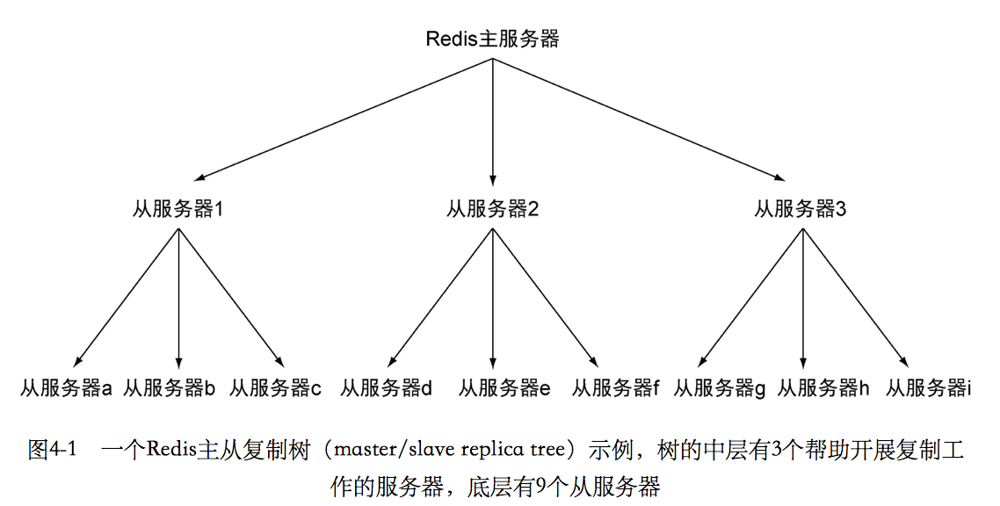

# Redis in action
## 第一章
### Redis简介
* Redis是一个速度非常快的非关系数据库，它可以存储键和5种不同类型value之间的映射。

* Redis实现了主从复制特性，执行复制的从服务器会连接主服务器，接受主服务器发送的整个数据库的初始copy，之后的主服务器的写命令，都会被发送给所有的连接的从服务器去执行，从而更新从服务器的数据集。

* 在Redis里面，用户可以直接使用原子的INCR命令及其变种来计算聚合数据，因为Redis数据在内存里面，而且发送给Redis的命令并不需要经过查询分析器或者查询优化器进行处理，所以Redis存储的数据执行随机写的速度总是迅速的。

一些数据库和缓存服务器的特性如下：

|名称| 类型 | 数据存储选项 |查询类型| 附加功能 |
| :--: | :--: | :--: |:--: | :--: |
| Redis | 使用内存存储的非关系数据库 | 字符串、列表、集合、散列表、有序集合|每种数据类型都有自己的专属命令，另外还有批量操作和不完全的事务支持| 发布和订阅，主从复制，持久化，脚本(存储化过程)|
|memcached|使用内存存储的键值缓存|键值之间的映射|创建命令、读取命令、更新命令、删除命令以及其他几个命令|为提升性能而设的多线程服务器|
|MySQL|关系数据库|每个数据库可以包含多个表，没个表可以包含多个行，可以处理多个表的视图，支持空间和第三方扩展| SELECT，INSERT，UPDATE，DELETE，函数，存储过程|支持ACID性质，主从复制和主主复制|
|PostgreSQL|关系数据库|每个数据库可以包含多个表，每个表可以包含多个行，可以处理多个表的视图，支持空间和第三方扩展，支持可定制类型|SELECT，INSERT，UPDATE，DELETE，内置函数，自定义的存储过程| 支持ACID性质，主从复制，由第三方支持的多主复制|
|MongoDB|使用硬盘存储的非关系文档存储|每个数据库可以包含多个表，每个表可以包含多个schema的BSON文档|创建命令，读取命令，更新命令，删除命令，条件查询命令等|支持map-reduce操作，主从复制，分片，空间索引


### Redis 基础命令
#### STRING

<div align="center">  </div><br>

```html
> set hello world
OK
> get hello
"world"
> del hello
(integer) 1
> get hello
(nil)
```

#### LIST

<div align="center">  </div><br>

```html
> rpush list-key item
(integer) 1
> rpush list-key item2
(integer) 2
> rpush list-key item
(integer) 3

> lrange list-key 0 -1
1) "item"
2) "item2"
3) "item"

> lindex list-key 1
"item2"

> lpop list-key
"item"

> lrange list-key 0 -1
1) "item2"
2) "item"
```

#### SET

<div align="center">  </div><br>

```html
> sadd set-key item
(integer) 1
> sadd set-key item2
(integer) 1
> sadd set-key item3
(integer) 1
> sadd set-key item
(integer) 0

> smembers set-key
1) "item"
2) "item2"
3) "item3"

> sismember set-key item4
(integer) 0
> sismember set-key item
(integer) 1

> srem set-key item2
(integer) 1
> srem set-key item2
(integer) 0

> smembers set-key
1) "item"
2) "item3"
```

#### HASH

<div align="center">  </div><br>

```html
> hset hash-key sub-key1 value1
(integer) 1
> hset hash-key sub-key2 value2
(integer) 1
> hset hash-key sub-key1 value1
(integer) 0

> hgetall hash-key
1) "sub-key1"
2) "value1"
3) "sub-key2"
4) "value2"

> hdel hash-key sub-key2
(integer) 1
> hdel hash-key sub-key2
(integer) 0

> hget hash-key sub-key1
"value1"

> hgetall hash-key
1) "sub-key1"
2) "value1"
```

#### ZSET

<div align="center">  </div><br>

```html
> zadd zset-key 728 member1
(integer) 1
> zadd zset-key 982 member0
(integer) 1
> zadd zset-key 982 member0
(integer) 0

> zrange zset-key 0 -1 withscores
1) "member1"
2) "728"
3) "member0"
4) "982"

> zrangebyscore zset-key 0 800 withscores
1) "member1"
2) "728"

> zrem zset-key member1
(integer) 1
> zrem zset-key member1
(integer) 0

> zrange zset-key 0 -1 withscores
1) "member0"
2) "982"
```

### 文章点赞

#### 数据模型
两个有序集合：

* time:，有序集合，存储的是根据时间排序的文章
* score:，有序集合存储的是根据评分排序的文章
* vote:acrticle_id，无序集合，存储的是为这个文章投票的用户
* article:article_id,散列表，存储文章的投票数 

#### 操作
##### 投票

```python

ONE_WEEK_IN_SECONDS = 7 * 86400                    
VOTE_SCORE = 432                                   
def article_vote(conn, user, article):
    cutoff = time.time() - ONE_WEEK_IN_SECONDS      
    # 获取文章的post的时间，看是否
    if conn.zscore('time:', article) < cutoff:    
        return

    article_id = article.partition(':')[-1] 
    # 根据sadd是否成功来，判断是否已经用户是否投票过     
    if conn.sadd('voted:' + article_id, user): 
    	 # 如果没有投票，增加文章的评分，每投一票增加VOTE_SCORE,     
        conn.zincrby('score:', article, VOTE_SCORE) 
        # 增加散列表里面文章的投票数
        conn.hincrby(article, 'votes', 1)           
```

##### 增加新文章

```python

def post_article(conn, user, title, link):
	# 自增，获取文章的id呀
    article_id = str(conn.incr('article:'))     #A

    voted = 'voted:' + article_id
    # 把作者添加到voted里面
    conn.sadd(voted, user)                      #B
    # 设置集合的过期日子
    conn.expire(voted, ONE_WEEK_IN_SECONDS)     #B

    now = time.time()
    article = 'article:' + article_id
    # 设置散列表的 key和value
    conn.hmset(article, {                       #C
        'title': title,                         #C
        'link': link,                           #C
        'poster': user,                         #C
        'time': now,                            #C
        'votes': 1,                             #C
    })                                          #C
	# 增加新的article 增加到score和time的有序集合
    conn.zadd('score:', article, now + VOTE_SCORE)  #D
    conn.zadd('time:', article, now)                #D

    return article_id          
```

##### 获取文章
```python
ARTICLES_PER_PAGE = 25

def get_articles(conn, page, order='score:'):
    start = (page-1) * ARTICLES_PER_PAGE            #A
    end = start + ARTICLES_PER_PAGE - 1             #A
	 # 获取多个文章的id
    ids = conn.zrevrange(order, start, end)         #B
    articles = []
    for id in ids:      
    	 # 获取文章的详细信息，所有的key，value都取出                            #C
        article_data = conn.hgetall(id)             #C
        article_data['id'] = id                     #C
        articles.append(article_data)               #C

    return articles

```

##### 文章分组
```python

def add_remove_groups(conn, article_id, to_add=[], to_remove=[]):
    article = 'article:' + article_id           #A
    for group in to_add:
        # 添加到所属的群组
        conn.sadd('group:' + group, article)    #B
    for group in to_remove:
        # 从群组里面移除文章
        conn.srem('group:' + group, article)    #C
```

##### 获取分组文章

```python
def get_group_articles(conn, group, page, order='score:'):
    key = order + group                                     #A
    # 看是否存在key
    if not conn.exists(key):                                #B
        # 进行交集计算，计算新的集合
        conn.zinterstore(key,                               #C
            ['group:' + group, order],                      #C
            aggregate='max',                                #C
        )
        #过期时间设置60s
        conn.expire(key, 60)                                #D
    return get_articles(conn, page, key)                    #E
```

## 第二章

如何使用更快的Redis查询来代替传统的的关系数据库查询，以及如何使用Redis来完成一些使用关系数据库没办法高效率完成的任务

### Redis管理用户的登录会话

1.尝试获取用户的登录token


```python
def check_token(conn, token):
	#  尝试根据token取获取用户的信息
    return conn.hget('login:', token)
```

2.更新用户的token


```python
def update_token(conn, token, user, item=None):
    timestamp = time.time()                             
    # 设置用户和token的对应表
    conn.hset('login:', token, user)                   
    # 将token添加进有序集合 recent:
    conn.zadd('recent:', token, timestamp)              #C
    if item:
    	 # 将商品添加进去用户的浏览记录
        conn.zadd('viewed:' + token, item, timestamp)  
        # 删除超过26的商品
        conn.zremrangebyrank('viewed:' + token, 0, -26) #E
```

3.清除用户的session

```python
def clean_sessions(conn):
    while not QUIT:
        # 确定集合的size大小没有超过限制
        size = conn.zcard('recent:')                    #A
        if size <= LIMIT:                               #B
            time.sleep(1)                               #B
            continue
		 
        end_index = min(size - LIMIT, 100)              #C
        tokens = conn.zrange('recent:', 0, end_index-1) #C

        session_keys = []                               #D
        for token in tokens:                            #D
            session_keys.append('viewed:' + token)      #D

        conn.delete(*session_keys)                      #E
        conn.hdel('login:', *tokens)                    #E
        conn.zrem('recent:', *tokens)                   #E
```

4.缓存用户的页面

```python
def cache_request(conn, request, callback):
	 # 不能缓存的页面，直接调用处理函数
    if not can_cache(conn, request):                #A
        return callback(request)                    #A
	
	# 获取页面的page_key, 
    page_key = 'cache:' + hash_request(request)     #B
    # 获取页面的内容
    content = conn.get(page_key)                    #C

    if not content:
        # 如果页面还没有被缓存就处理，就添加进去cache里面，并且设置超时时间
        content = callback(request)                 #D
        conn.setex(page_key, content, 300)          #E

    return content                                  #F
```

## 第三章

[Redis命令列表](https://redis.io/commands)

Redis的字符串就是一个字节组成的序列，Redis的字符串可以存储

*  字符串
*  整数
*  浮点数

Redis的一个主要的优点在于它可以包含多个字符串的值，它使得用户可以将数据集集中起来，Redis集合中只能保存各自不同的元素。

Redis为散列值提供了和字符串相同的特性，使得散列值非常适用于讲一些相关的数据存储到一起，我们可以这种数据聚集看成是关系数据中的行，或者文档数据中的文档。

Redis中的订阅和发布模式非常有用，但是不经常使用

* Redis系统的稳定性，因为对于旧版的R俄狄塞说，当客户端消费消息的速度不够快的话，那么不断加压的消息是的Redis输出缓冲区的体积变大，导致Redis崩溃等，新版的Redis会自动断开不符合client-output-buffer-limit pubsub配置选项要求的订阅客户端
* 如果客户端在执行订阅操作的过程中断线，那么客户端会丢失在断线期间发送的所有消息，因此依靠频频道来接收消息的用户可能会懂Redis的PUBLISH和SUBSCRIBE命令感到失望

在Redis里面，被MULTI和EXEC命令包围的所有的命令会一个个地执行，知道所有的命令都被执行完毕为止，当一个事务执行完毕之后，Redis才会处理其他客户端的命令

Redis事务在python客户端是由pipeline实现的，对连接对象调用pipeline方法将创建一个事务，在正常情况下将自动使用MULTI和EXEC包裹起用户输入的多个命令。

在本书的常用的命令当中，只有少数几个命令可以原子的设置键的时间，并且对于列表，集合，散列表和有序集合这样的容器来说，键过期命令只能为整个键设置过期时间，而没办法为单个元素设置过期时间。


## 第四章

### 持久化
Redis 提供了两种不同的持久化的选项

* 快照，会将存在于某一个时刻的所有的数据都写入硬盘里面


```
save 60 100
# 创建快照失败是否还执行写命令
stop-writes-on-bgsave-error no
rdbcompression yes
# 硬盘上的快照名字
dbfilename dump.rdb
```

1. 	客户端可以通过BGSAVE或者SAVE取创建快照，其中SAVE会阻塞命令请求去创建快照
2. 如果用户设置了save配置选项如“save 60 10000”，那么从最近创建快照开始，当“60s内有10000次请求”满足的时候，才会触发快照。
3. Redis通过SHUTDOWN或者TERM命令的时候，会触发一次SAVE命令。
4. 如果系统崩溃，用户将丢失最后一次生成快照之后更改的所有的数据。
5. Redis进程每占用1GB的内存，那么创建子进程所需要的时间就要增加200-300毫秒，为了防止出现停顿，可以手动的执行BGSAVE或者SAVE命令，唯一不同的是用户可以通过BGSAVE命令去控制停顿出现的时间。SAVE 3-5min BGSAVE往往需要15-20min分钟的处理，

* 只追加文件，会在执行写命令的时候，将写命令写到硬盘中


```
# 是否使用appendonly
appendonly no
# 多久将内容写到硬盘
apppendfsync everysec
no-appendfsync-on-rewrite no
auto-aof-rewrite-percentage 100
uto-aof-rewrite-min-size 64mb
# 存储路径
dir ./
```

1. 	AOF持久化将被执行的写命令写到AOF文件的末尾，Redis只要从头执行一遍AOF文件所包含的所有的写命令，就可以恢复AOF文件的数据集，
2. appendfsync: always everysec no
3. Redis不断运行，AOF文件的体积变大，可能回用完硬盘空间，Redis重启后重新执行命令的操作时间过长
4. 用户可以发送BGREWRITEAOF命令去重写AOF文件，减少文件的体积
5. auto-aof-rewrite-percentage 100，auto-aof-rewrite-min-size 64mb，选项表示当文件体积大于64mb，并且比上次的重写文件的体积大100%的时候，进行重写


### 复制

* Redis性能优秀，但是遇到没办法快速处理的情况，特别是在对集合或者有序集合进行操作的时候，涉及的元素可能有几万个或者上百万个，执行操作的时间可能会到几秒的情况。
* 单个Redis实例，每秒只能处理100多个命令
* 在实际使用的过程，redis最好使用50%-65%的内存，留下剩下的内存执行BGSAVE和创建写缓冲区
* 当多个从服务器连接主服务器的时候，同步多个从服务器可能会占用带宽，是其他命令难以传递到主服务器
* 从服务器也可以有自己的从服务器，形成主从链


<div align="center">  </div><br>

* 通过同时使用复制和持久化，增加系统的容灾能力
* INFO命令提供了大量关于服务器状态的信息，如内存占用量，连接数，每个数据库的键数量和上一次创建快照后的执行命令的数量
* 等待主从的同步

```python
def wait_for_sync(mconn, sconn):
    identifier = str(uuid.uuid4())
    mconn.zadd('sync:wait', identifier, time.time())        #A
	# 检测从服务器是否连接上
    while not sconn.info()['master_link_status'] != 'up':   #B
        time.sleep(.001)
	# 检查添加的item有没有到从服务器
    while not sconn.zscore('sync:wait', identifier):        #C
        time.sleep(.001)

    deadline = time.time() + 1.01  
    # 检测有没有同步从服务器的硬盘                         #D
    while time.time() < deadline:                           #D
        if sconn.info()['aof_pending_bio_fsync'] == 0:      #E
            break                                           #E
        time.sleep(.001)
	# 删除测试的token
    mconn.zrem('sync:wait', identifier)                     #F
    mconn.zremrangebyscore('sync:wait', 0, time.time()-900) #F
```

开启从服务器命令

```
slaveof host port（会自动连接主服务器，开启复制） // slaveof no one(停止连接)
```
|步骤|主服务器|从服务器|
| --- | --- |---|
|1|等待命令进入|连接主服务器，发送SYNC|
|2|开始执行BGSSAVE，并用缓冲区记录BGSAVE后的命令|根据配置选项来决定是使用有的数据来处理客户端的命令请求，还是发送请求的客户端返回错误|
|3|BGSAVE执行完毕，发送快照，继续存储写命令到缓冲区|丢弃就数据，载入主服务器的快照文件|
|4|发送完毕，发送存储在缓冲区的写命令|完成对快照的解释操作，并像往常一样接受命令请求|
|5|缓冲区存储的命令发送完毕，之后没执行一次写命令就发送一次写命令到从服务器|执行缓冲区写命令，接受并执行发来的每个写命令|

### 处理系统故障
* 用户最好为重要的快照文件，搞多个备份，并在数据恢复的时候，通过计算快照文件SHA1的值和SHA256的值来对内容进行验证
* Redis sentinel可以自动监控主从服务器，并且自动进行failover

验证快照和AOF文件命令

```
redis-check-aof
redis-check-dump
```

替换故障节点的命令，主A服务器故障，SAVE B服务器，然后设置C服务器为主服务器

```
user@vpn-master ~:$ ssh root@machine-b.vpn                          #A
Last login: Wed Mar 28 15:21:06 2012 from ...                       #A
root@machine-b ~:$ redis-cli                                        #B
redis 127.0.0.1:6379> SAVE                                          #C
OK                                                                  #C
redis 127.0.0.1:6379> QUIT                                          #C
root@machine-b ~:$ scp \\                                           #D
> /var/local/redis/dump.rdb machine-c.vpn:/var/local/redis/         #D
dump.rdb                      100%   525MB  8.1MB/s   01:05         #D
root@machine-b ~:$ ssh machine-c.vpn                                #E
Last login: Tue Mar 27 12:42:31 2012 from ...                       #E
root@machine-c ~:$ sudo /etc/init.d/redis-server start              #E
Starting Redis server...                                            #E
root@machine-c ~:$ exit
root@machine-b ~:$ redis-cli                                        #F
redis 127.0.0.1:6379> SLAVEOF machine-c.vpn 6379                    #F
OK                                                                  #F
redis 127.0.0.1:6379> QUIT
root@machine-b ~:$ exit
user@vpn-master ~:$
```

### Redis事务

* 延迟事务有助于提升性能，等到事务所有的命令都到达后，才一次性的将MULTI，命令和EXEC命令提交给服务器，称为流水线，较少客户端和服务器的通信次数，提升性能
* Redis在执行EXEC之前，不会执行任何命令，所有根据读取的数据执行来进行相应操作变得困难
* 因为在多个事务中处理同一个对象，通常会用到二阶提交，如果事务不能一致的读取数据的话，那么二阶提交不能实现，导致一些可以成功执行的事务到失败的地步
* 在用户使用WATCH命令对键进行监视后，直到用户执行EXEC命令的这段时间里面，如果有其他客户端抢先对被监视的键进行了替换，更新和删除等操作，那么用户执行EXEC的时候，会显示失败，可以选择重试或者放弃事务
* DISCARD取消WATCH命令，并且清空所有入列的命令
* 通过执行WATCH命令的客户端，这种做法是乐观锁，而关系数据库执行的加锁操作时悲观锁
* 我们可以通过pipeline函数传入False，来进一步提升Redis的性能
* redis-benchmark命令可以大概查看性能
* ACID,atomicity，consistency，isolation，durability(耐久性),实现可靠的事务属性

watch 命令的使用

```python
def list_item(conn, itemid, sellerid, price):
    inventory = "inventory:%s"%sellerid
    item = "%s.%s"%(itemid, sellerid)
    end = time.time() + 5
    pipe = conn.pipeline()

    while time.time() < end:
        try:
        	  # 监视用户的inventory
            pipe.watch(inventory)                    #A
            # 确认物品在inventory中
            if not pipe.sismember(inventory, itemid):#B
                pipe.unwatch()                       #E
                return None

            pipe.multi()                             #C
            # 加入到市场中
            pipe.zadd("market:", item, price)        #C
            # 商品从set中移除
            pipe.srem(inventory, itemid)             #C
            pipe.execute()                           #F
            return True
        except redis.exceptions.WatchError:          #D
            pass                                     #D
    return False
```

redis-benchmark命令的使用

```shell
redis-benchmark -c 1 -q // -q 简化输出结果，-c使用多少个客户端
```

## 第五章

### 日志记录

* 常见的日志处理：
	1. 放到日志文件里面
	2. 使用syslog服务，接受其他程序发来的消息
* 替换syslog，使用syslog-ng, 用来管理和组织日志更加简单

```python
SEVERITY = {                                                    #A
    logging.DEBUG: 'debug',                                     #A
    logging.INFO: 'info',                                       #A
    logging.WARNING: 'warning',                                 #A
    logging.ERROR: 'error',                                     #A
    logging.CRITICAL: 'critical',                               #A
}                                                               #A
SEVERITY.update((name, name) for name in SEVERITY.values())     #A

def log_recent(conn, name, message, severity=logging.INFO, pipe=None):
    severity = str(SEVERITY.get(severity, severity)).lower()    #B
    destination = 'recent:%s:%s'%(name, severity)               #C
    message = time.asctime() + ' ' + message                    #D
    pipe = pipe or conn.pipeline()                              #E
    pipe.lpush(destination, message)                            #F
    # 只保留最近的100条
    pipe.ltrim(destination, 0, 99)                              #G
    pipe.execute()  
                                                #H
def log_common(conn, name, message, severity=logging.INFO, timeout=5):
    severity = str(SEVERITY.get(severity, severity)).lower()    #A
    destination = 'common:%s:%s'%(name, severity)               #B
    start_key = destination + ':start'                          #C
    pipe = conn.pipeline()
    end = time.time() + timeout
    while time.time() < end:
        try:
            pipe.watch(start_key)                               #D
            now = datetime.utcnow().timetuple()                 #E
            hour_start = datetime(*now[:4]).isoformat()         #F

            existing = pipe.get(start_key)
            pipe.multi()                                        #H
            if existing and existing < hour_start:              #G
            	   # 重命名旧的日志集合
                pipe.rename(destination, destination + ':last') #I
                pipe.rename(start_key, destination + ':pstart') #I
                pipe.set(start_key, hour_start)                 #J
            elif not existing:                                  #J
                pipe.set(start_key, hour_start)                 #J

            pipe.zincrby(destination, message)                  #K
            log_recent(pipe, name, message, severity, pipe)     #L
            return
        except redis.exceptions.WatchError:
            continue  
```

## 第六章

### 自动补全函数

* 通过向有序集合添加元素来创建查找范围，并在范围内的元素之后移除之前添加的元素，这种技术同样可以运用于任何已经排序的索引上面


```python
valid_characters = '`abcdefghijklmnopqrstuvwxyz{'             #A

def find_prefix_range(prefix):
    posn = bisect.bisect_left(valid_characters, prefix[-1:])  #B
    suffix = valid_characters[(posn or 1) - 1]                #C
    return prefix[:-1] + suffix + '{', prefix + '{'           #D

#A Set up our list of characters that we know about
#B Find the position of prefix character in our list of characters
#C Find the predecessor character
#D Return the range
#END

def autocomplete_on_prefix(conn, guild, prefix):
    start, end = find_prefix_range(prefix)                 #A
    # 防止移除其他添加的start和end
    identifier = str(uuid.uuid4())                         #A
    start += identifier                                    #A
    end += identifier                                      #A
    zset_name = 'members:' + guild

    conn.zadd(zset_name, start, 0, end, 0)                 #B
    pipeline = conn.pipeline(True)
    while 1:
        try:
            pipeline.watch(zset_name)
            sindex = pipeline.zrank(zset_name, start)      #C
            eindex = pipeline.zrank(zset_name, end)        #C
            erange = min(sindex + 9, eindex - 2)           #C
            pipeline.multi()
            pipeline.zrem(zset_name, start, end)           #D
            pipeline.zrange(zset_name, sindex, erange)     #D
            items = pipeline.execute()[-1]                 #D
            break
        except redis.exceptions.WatchError:                #E
            continue                                       #E

    return [item for item in items if '{' not in item]     #F
#A Find the start/end range for the prefix
#B Add the start/end range items to the ZSET
#C Find the ranks of our end points
#D Get the values inside our range, and clean up
#E Retry if someone modified our autocomplete zset
#F Remove start/end entries if an autocomplete was in progress
```

### 分布式锁

* 为了对Redis存储数据进行排他性访问，客户端需要访问一个锁，这个锁必须定义在所有客户端都能看到的范围内，而这个锁就在Redis里面，我们必须把锁
* 使用Redis的WATCH命令，监视被频繁访问的键，可能会出现性能问题
* WATCH，MUTLTI, EXEC组成的事务并不具有可扩展性，原因在于程序再尝试完成一个事务后，会因为事务执行失败而不断的重试
* 持有锁的进程因为操作时间过长而导致锁被释放，但进程并不知道，错误的释放掉了其他进程的锁
* 一个持有锁的进程崩溃，其他进程浪费时间等待
* 一个进程持有的锁过期后，其他多个进程获得锁，都获得了成功


```python
def acquire_lock(conn, lockname, acquire_timeout=10):
    identifier = str(uuid.uuid4())                      #A

    end = time.time() + acquire_timeout
    while time.time() < end:
        """Set the value of a key, only if the key does not exist."""
        if conn.setnx('lock:' + lockname, identifier):  #B
            return identifier

        time.sleep(.001)

    return False
    
# <start id="_1314_14473_8645"/>
def purchase_item_with_lock(conn, buyerid, itemid, sellerid):
    buyer = "users:%s" % buyerid
    seller = "users:%s" % sellerid
    item = "%s.%s" % (itemid, sellerid)
    inventory = "inventory:%s" % buyerid

    locked = acquire_lock(conn, 'market:')     #A
    if not locked:
        return False

    pipe = conn.pipeline(True)
    try:
        pipe.zscore("market:", item)           #B
        pipe.hget(buyer, 'funds')              #B
        price, funds = pipe.execute()          #B
        if price is None or price > funds:     #B
            return None                        #B

        pipe.hincrby(seller, 'funds', int(price))  #C
        pipe.hincrby(buyer, 'funds', int(-price))  #C
        pipe.sadd(inventory, itemid)               #C
        pipe.zrem("market:", item)                 #C
        pipe.execute()                             #C
        return True
    finally:
        release_lock(conn, 'market:', locked)      #D
# <end id="_1314_14473_8645"/>
#A Get the lock
#B Check for a sold item or insufficient funds
#C Transfer funds from the buyer to the seller, and transfer the item to the buyer
#D Release the lock
#END

# <start id="_1314_14473_8650"/>
def release_lock(conn, lockname, identifier):
    pipe = conn.pipeline(True)
    lockname = 'lock:' + lockname

    while True:
        try:
            pipe.watch(lockname)                  #A
            if pipe.get(lockname) == identifier:  #A
                pipe.multi()                      #B
                pipe.delete(lockname)             #B
                pipe.execute()                    #B
                return True                       #B

            pipe.unwatch()
            break

        except redis.exceptions.WatchError:       #C
            pass                                  #C

    return False                                  #D
# <end id="_1314_14473_8650"/>
#A Check and verify that we still have the lock
#B Release the lock
#C Someone else did something with the lock, retry
#D We lost the lock
#END
```

带有超时设置的锁

```python
def acquire_lock_with_timeout(
    conn, lockname, acquire_timeout=10, lock_timeout=10):
    identifier = str(uuid.uuid4())                      #A
    lockname = 'lock:' + lockname
    lock_timeout = int(math.ceil(lock_timeout))         #D

    end = time.time() + acquire_timeout
    while time.time() < end:
        if conn.setnx(lockname, identifier):            #B
            conn.expire(lockname, lock_timeout)         #B
            return identifier
        elif conn.ttl(lockname) < 0:                    #C
            conn.expire(lockname, lock_timeout)         #C

        time.sleep(.001)

    return False
# <end id="_1314_14473_8790"/>
#A A 128-bit random identifier
#B Get the lock and set the expiration
#C Check and update the expiration time as necessary
#D Only pass integers to our EXPIRE calls
#END
```

### 计数信号量
* 假设不同客户端所在的系统时间都是相同的

```python

# <start id="_1314_14473_8986"/>
def acquire_semaphore(conn, semname, limit, timeout=10):
    identifier = str(uuid.uuid4())                             #A
    now = time.time()

    pipeline = conn.pipeline(True)
    # 清楚过期的信号量
    pipeline.zremrangebyscore(semname, '-inf', now - timeout)  #B
    pipeline.zadd(semname, identifier, now)                    #C
    pipeline.zrank(semname, identifier)                        #D
    if pipeline.execute()[-1] < limit:                         #D
        return identifier

    conn.zrem(semname, identifier)                             #E
    return None
# <end id="_1314_14473_8986"/>
#A A 128-bit random identifier
#B Time out old semaphore holders
#C Try to acquire the semaphore
#D Check to see if we have it
#E We failed to get the semaphore, discard our identifier
#END

# <start id="_1314_14473_8990"/>
def release_semaphore(conn, semname, identifier):
	 # 释放信号量
    return conn.zrem(semname, identifier)                      #A
# <end id="_1314_14473_8990"/>
#A Returns True if the semaphore was properly released, False if it had timed out
#END
```

公平信号量

```python
# <start id="_1314_14473_9004"/>
def acquire_fair_semaphore(conn, semname, limit, timeout=10):
    identifier = str(uuid.uuid4())                             #A
    czset = semname + ':owner'
    ctr = semname + ':counter'

    now = time.time()
    pipeline = conn.pipeline(True)
    pipeline.zremrangebyscore(semname, '-inf', now - timeout)  #B
    pipeline.zinterstore(czset, {czset: 1, semname: 0})        #B

    pipeline.incr(ctr)                                         #C
    counter = pipeline.execute()[-1]                           #C

    pipeline.zadd(semname, identifier, now)                    #D
    pipeline.zadd(czset, identifier, counter)                  #D

    pipeline.zrank(czset, identifier)                          #E
    if pipeline.execute()[-1] < limit:                         #E
        return identifier                                      #F

    pipeline.zrem(semname, identifier)                         #G
    pipeline.zrem(czset, identifier)                           #G
    pipeline.execute()
    return None
# <end id="_1314_14473_9004"/>
#A A 128-bit random identifier
#B Time out old entries
#C Get the counter
#D Try to acquire the semaphore
#E Check the rank to determine if we got the semaphore
#F We got the semaphore
#G We didn't get the semaphore, clean out the bad data
#END

# <start id="_1314_14473_9014"/>
def release_fair_semaphore(conn, semname, identifier):
    pipeline = conn.pipeline(True)
    pipeline.zrem(semname, identifier)
    pipeline.zrem(semname + ':owner', identifier)
    return pipeline.execute()[0]                               #A
# <end id="_1314_14473_9014"/>
#A Returns True if the semaphore was properly released, False if it had timed out
#END

# <start id="_1314_14473_9022"/>
def refresh_fair_semaphore(conn, semname, identifier):
    if conn.zadd(semname, identifier, time.time()):            #A
        release_fair_semaphore(conn, semname, identifier)      #B
        return False                                           #B
    return True  
```

## 第七章

### 搜索
* 反向索引市互联网上绝大部分搜索引擎所使用的底层结构
* 反向索引会从每个被索引的稳定里面提取一些单词，并创建表格来记录每篇文章都包含了哪些单词

```python
STOP_WORDS = set('''able about across after all almost also am among
an and any are as at be because been but by can cannot could dear did
do does either else ever every for from get got had has have he her
hers him his how however if in into is it its just least let like
likely may me might most must my neither no nor not of off often on
only or other our own rather said say says she should since so some
than that the their them then there these they this tis to too twas us
wants was we were what when where which while who whom why will with
would yet you your'''.split())                                          #A

WORDS_RE = re.compile("[a-z']{2,}")                                     #B

def tokenize(content):
    words = set()                                                       #C
    for match in WORDS_RE.finditer(content.lower()):                    #D
        word = match.group().strip("'")                                 #E
        if len(word) >= 2:                                              #F
            words.add(word)                                             #F
    return words - STOP_WORDS                                           #G

def index_document(conn, docid, content):
    words = tokenize(content)                                           #H

    pipeline = conn.pipeline(True)
    for word in words:                                                  #I
        pipeline.sadd('idx:' + word, docid)                             #I
    return len(pipeline.execute())                                      #J
# <end id="tokenize-and-index"/>
#A We pre-declare our known stop words, these were fetched from http://www.textfixer.com/resources/
#B A regular expression that extracts words as we defined them
#C Our Python set of words that we have found in the document content
#D Iterate over all of the words in the content
#E Strip any leading or trailing single-quote characters
#F Keep any words that are still at least 2 characters long
#G Return the set of words that remain that are also not stop words
#H Get the tokenized words for the content
#I Add the documents to the appropriate inverted index entries
#J Return the number of unique non-stop words that were added for the document
#END

# <start id="_1314_14473_9158"/>
def _set_common(conn, method, names, ttl=30, execute=True):
    id = str(uuid.uuid4())                                  #A
    pipeline = conn.pipeline(True) if execute else conn     #B
    names = ['idx:' + name for name in names]               #C
    getattr(pipeline, method)('idx:' + id, *names)          #D
    pipeline.expire('idx:' + id, ttl)                       #E
    if execute:
        pipeline.execute()                                  #F
    return id                                               #G

def intersect(conn, items, ttl=30, _execute=True):          #H
    return _set_common(conn, 'sinterstore', items, ttl, _execute) #H

def union(conn, items, ttl=30, _execute=True):                    #I
    return _set_common(conn, 'sunionstore', items, ttl, _execute) #I

def difference(conn, items, ttl=30, _execute=True):               #J
    return _set_common(conn, 'sdiffstore', items, ttl, _execute)  #J
# <end id="_1314_14473_9158"/>
#A Create a new temporary identifier
#B Set up a transactional pipeline so that we have consistent results for each individual call
#C Add the 'idx:' prefix to our terms
#D Set up the call for one of the operations
#E Instruct Redis to expire the SET in the future
#F Actually execute the operation
#G Return the id for the caller to process the results
#H Helper function to perform SET intersections
#I Helper function to perform SET unions
#J Helper function to perform SET differences
#END

# <start id="parse-query"/>
QUERY_RE = re.compile("[+-]?[a-z']{2,}")                #A

def parse(query):
    unwanted = set()                                    #B
    all = []                                            #C
    current = set()                                     #D
    for match in QUERY_RE.finditer(query.lower()):      #E
        word = match.group()                            #F
        prefix = word[:1]                               #F
        if prefix in '+-':                              #F
            word = word[1:]                             #F
        else:                                           #F
            prefix = None                               #F

        word = word.strip("'")                          #G
        if len(word) < 2 or word in STOP_WORDS:         #G
            continue                                    #G

        if prefix == '-':                               #H
            unwanted.add(word)                          #H
            continue                                    #H

        if current and not prefix:                      #I
            all.append(list(current))                   #I
            current = set()                             #I
        current.add(word)                               #J

    if current:                                         #K
        all.append(list(current))                       #K

    return all, list(unwanted)                          #L
# <end id="parse-query"/>
#A Our regular expression for finding wanted, unwanted, and synonym words
#B A unique set of unwanted words
#C Our final result of words that we are looking to intersect
#D The current unique set of words to consider as synonyms
#E Iterate over all words in the search query
#F Discover +/- prefixes, if any
#G Strip any leading or trailing single quotes, and skip anything that is a stop word
#H If the word is unwanted, add it to the unwanted set
#I Set up a new synonym set if we have no synonym prefix and we already have words
#J Add the current word to the current set
#K Add any remaining words to the final intersection
#END

# <start id="search-query"/>
def parse_and_search(conn, query, ttl=30):
    all, unwanted = parse(query)                                    #A
    if not all:                                                     #B
        return None                                                 #B

    to_intersect = []
    for syn in all:                                                 #D
        if len(syn) > 1:                                            #E
            to_intersect.append(union(conn, syn, ttl=ttl))          #E
        else:                                                       #F
            to_intersect.append(syn[0])                             #F

    if len(to_intersect) > 1:                                       #G
        intersect_result = intersect(conn, to_intersect, ttl=ttl)   #G
    else:                                                           #H
        intersect_result = to_intersect[0]                          #H

    if unwanted:                                                    #I
        unwanted.insert(0, intersect_result)                        #I
        return difference(conn, unwanted, ttl=ttl)                  #I

    return intersect_result                                         #J
# <end id="search-query"/>
#A Parse the query
#B If there are no words in the query that are not stop words, we don't have a result
#D Iterate over each list of synonyms
#E If the synonym list is more than one word long, then perform the union operation
#F Otherwise use the individual word directly
#G If we have more than one word/result to intersect, intersect them
#H Otherwise use the individual word/result directly
#I If we have any unwanted words, remove them from our earlier result and return it
#J Otherwise return the intersection result
#END


# <start id="sorted-searches"/>
def search_and_sort(conn, query, id=None, ttl=300, sort="-updated", #A
                    start=0, num=20):                               #A
    desc = sort.startswith('-')                                     #B
    sort = sort.lstrip('-')                                         #B
    by = "kb:doc:*->" + sort                                        #B
    alpha = sort not in ('updated', 'id', 'created')                #I

    if id and not conn.expire(id, ttl):     #C
        id = None                           #C

    if not id:                                      #D
        id = parse_and_search(conn, query, ttl=ttl) #D

    pipeline = conn.pipeline(True)
    pipeline.scard('idx:' + id)                                     #E
    pipeline.sort('idx:' + id, by=by, alpha=alpha,                  #F
        desc=desc, start=start, num=num)                            #F
    results = pipeline.execute()

    return results[0], results[1], id                               #G
# <end id="sorted-searches"/>
#A We will optionally take an previous result id, a way to sort the results, and options for paginating over the results
#B Determine which attribute to sort by, and whether to sort ascending or descending
#I We need to tell Redis whether we are sorting by a number or alphabetically
#C If there was a previous result, try to update its expiration time if it still exists
#D Perform the search if we didn't have a past search id, or if our results expired
#E Fetch the total number of results
#F Sort the result list by the proper column and fetch only those results we want
#G Return the number of items in the results, the results we wanted, and the id of the results so that we can fetch them again later
#END
```

### 字符串转化为分值

```python
def string_to_score(string, ignore_case=False):
    if ignore_case:                         #A
        string = string.lower()             #A

    pieces = map(ord, string[:6])           #B
    while len(pieces) < 6:                  #C
        pieces.append(-1)                   #C

    score = 0
    for piece in pieces:                    #D
        score = score * 257 + piece + 1     #D

    return score * 2 + (len(string) > 6)    #E
# <end id="string-to-score"/>
#A We can handle optional case-insensitive indexes easily, so we will
#B Convert the first 6 characters of the string into their numeric values, null being 0, tab being 9, capital A being 65, etc.
#C For strings that aren't at least 6 characters long, we will add place-holder values to represent that the string was short
#D For each value in the converted string values, we add it to the score, taking into consideration that a null is different from a place holder
#E Because we have an extra bit, we can also signify whether the string is exactly 6 characters or more, allowing us to differentiate 'robber' and 'robbers', though not 'robbers' and 'robbery'
#END
```

## 第八章

### 构建社交网站

#### 用户
* 用户的信息是存储在散列表里面


```python
def create_user(conn, login, name):
    llogin = login.lower()
    lock = acquire_lock_with_timeout(conn, 'user:' + llogin, 1) #A
    # 加锁不成功，说明已经被其他用户占用了
    if not lock:                            #B
        return None                         #B

    if conn.hget('users:', llogin):         #C
        release_lock(conn, 'user:' + llogin, lock)  #C
        return None                         #C
	 # 创建用户id
    id = conn.incr('user:id:')              #D
    pipeline = conn.pipeline(True)
    pipeline.hset('users:', llogin, id)     #E
    pipeline.hmset('user:%s'%id, {          #F
        'login': login,                     #F
        'id': id,                           #F
        'name': name,                       #F
        'followers': 0,                     #F
        'following': 0,                     #F
        'posts': 0,                         #F
        'signup': time.time(),              #F
    })
    pipeline.execute()
    release_lock(conn, 'user:' + llogin, lock)  #G
    return id 
```

#### 状态消息

```python
def create_status(conn, uid, message, **data):
    pipeline = conn.pipeline(True)
    pipeline.hget('user:%s'%uid, 'login')   #A
    pipeline.incr('status:id:')             #B
    login, id = pipeline.execute()
	 # 验证用户的账户是否存在
    if not login:                           #C
        return None                         #C

    data.update({
        'message': message,                 #D
        'posted': time.time(),              #D
        'id': id,                           #D
        'uid': uid,                         #D
        'login': login,                     #D
    })
    pipeline.hmset('status:%s'%id, data)    #D
    # 更新用户已发送状态的数量
    pipeline.hincrby('user:%s'%uid, 'posts')#E
    pipeline.execute()
    return id 
```

#### 主页时间线
* 希望用有序集合来实现时间线，分值用于记录状态消息发布时的时间戳
* 个人时间线只需要将timeline转化为profile

```python
def get_status_messages(conn, uid, timeline='home:', page=1, count=30):#A
    statuses = conn.zrevrange(                                  #B
        '%s%s'%(timeline, uid), (page-1)*count, page*count-1)   #B

    pipeline = conn.pipeline(True)
    for id in statuses:                                         #C
        pipeline.hgetall('status:%s'%id)                        #C

    return filter(None, pipeline.execute())                     #D
```

#### 关注和被关注者列表

```python
HOME_TIMELINE_SIZE = 1000
def follow_user(conn, uid, other_uid):
    fkey1 = 'following:%s'%uid          #A
    fkey2 = 'followers:%s'%other_uid    #A

    if conn.zscore(fkey1, other_uid):   #B
        return None                     #B

    now = time.time()

    pipeline = conn.pipeline(True)
    pipeline.zadd(fkey1, other_uid, now)    #C
    pipeline.zadd(fkey2, uid, now)          #C
    pipeline.zrevrange('profile:%s'%other_uid,      #E
        0, HOME_TIMELINE_SIZE-1, withscores=True)   #E
    following, followers, status_and_score = pipeline.execute()[-3:]

    pipeline.hincrby('user:%s'%uid, 'following', int(following))        #F
    pipeline.hincrby('user:%s'%other_uid, 'followers', int(followers))  #F
    if status_and_score:
        pipeline.zadd('home:%s'%uid, **dict(status_and_score))  #G
    pipeline.zremrangebyrank('home:%s'%uid, 0, -HOME_TIMELINE_SIZE-1)#G

    pipeline.execute()
    return True                         #H

def unfollow_user(conn, uid, other_uid):
    fkey1 = 'following:%s'%uid          #A
    fkey2 = 'followers:%s'%other_uid    #A

    if not conn.zscore(fkey1, other_uid):   #B
        return None                         #B

    pipeline = conn.pipeline(True)
    pipeline.zrem(fkey1, other_uid)                 #C
    pipeline.zrem(fkey2, uid)                       #C
    pipeline.zrevrange('profile:%s'%other_uid,      #E
        0, HOME_TIMELINE_SIZE-1)                    #E
    following, followers, statuses = pipeline.execute()[-3:]

    pipeline.hincrby('user:%s'%uid, 'following', -int(following))        #F
    pipeline.hincrby('user:%s'%other_uid, 'followers', -int(followers))  #F
    if statuses:
        pipeline.zrem('home:%s'%uid, *statuses)                 #G

    pipeline.execute()
    return True 
```

#### 时间线的更新

```python
def post_status(conn, uid, message, **data):
    id = create_status(conn, uid, message, **data)  #A
    if not id:              #B
        return None         #B

    posted = conn.hget('status:%s'%id, 'posted')    #C
    if not posted:                                  #D
        return None                                 #D

    post = {str(id): float(posted)}
    conn.zadd('profile:%s'%uid, **post)             #E

    syndicate_status(conn, uid, post)       #F
    return id

POSTS_PER_PASS = 1000           #A
def syndicate_status(conn, uid, post, start=0):
    followers = conn.zrangebyscore('followers:%s'%uid, start, 'inf',#B
        start=0, num=POSTS_PER_PASS, withscores=True)   #B

    pipeline = conn.pipeline(False)
    for follower, start in followers:                    #E
        pipeline.zadd('home:%s'%follower, **post)        #C
        pipeline.zremrangebyrank(                        #C
            'home:%s'%follower, 0, -HOME_TIMELINE_SIZE-1)#C
    pipeline.execute()

    if len(followers) >= POSTS_PER_PASS:                    #D
        execute_later(conn, 'default', 'syndicate_status',  #D
            [conn, uid, post, start])  
            
def delete_status(conn, uid, status_id):
    key = 'status:%s'%status_id
    lock = acquire_lock_with_timeout(conn, key, 1)  #A
    if not lock:                #B
        return None             #B

    if conn.hget(key, 'uid') != str(uid):   #C
        release_lock(conn, key, lock)       #C
        return None                         #C

    pipeline = conn.pipeline(True)
    pipeline.delete(key)                            #D
    pipeline.zrem('profile:%s'%uid, status_id)      #E
    pipeline.zrem('home:%s'%uid, status_id)         #F
    pipeline.hincrby('user:%s'%uid, 'posts', -1)    #G
    pipeline.execute()

    release_lock(conn, key, lock)
    return True
```

### 流API
* 流API请求则需要在一段比较长的时间内持续地返回数据
* 流API需要对外公开哪些事件
* 是否有限制，如果有需要，如何实现
* 应该提供哪些过滤选项
* 使用分块传输编码，我们可以使用Web服务器发送增量数据


## 第九章

### 使用短结构
* Redis为列表，集合，散列和有序集合提供了一组配置选项，这些选项可以让Redis以更节约空间的方式存储长度较短的结构
* Redis可以使用一种名为ziplis的紧凑存储方式来存储这些结构
* 压缩列表会以序列化的方式存储数据结构

debug object 命令去查看object

```python
>>> conn.rpush('test', 'a', 'b', 'c', 'd')  #A
4                                           #A
>>> conn.debug_object('test')                                       #B
{'encoding': 'ziplist', 'refcount': 1, 'lru_seconds_idle': 20,      #C
'lru': 274841, 'at': '0xb6c9f120', 'serializedlength': 24,          #C
'type': 'Value'}                                                    #C
>>> conn.rpush('test', 'e', 'f', 'g', 'h')  #D
8                                           #D
>>> conn.debug_object('test')
{'encoding': 'ziplist', 'refcount': 1, 'lru_seconds_idle': 0,   #E
'lru': 274846, 'at': '0xb6c9f120', 'serializedlength': 36,      #E
'type': 'Value'}
>>> conn.rpush('test', 65*'a')          #F
9
>>> conn.debug_object('test')
{'encoding': 'linkedlist', 'refcount': 1, 'lru_seconds_idle': 10,   #F
'lru': 274851, 'at': '0xb6c9f120', 'serializedlength': 30,          #G
'type': 'Value'}
>>> conn.rpop('test') 
```

* 如果整数包含的所有的成员都可以被解释为十进制整数，而这些整数又在平台的有符号整数范围之内，并且集合的数量有足够小的话，那么Redis就会以有序整数数组的方式存储集合，称为整数集合
* 对一个压缩列表的其中一部分数据进行更新，可能需要对整个列表进行解码，因此读写一个长度较长的压缩列表可能对性能有影响
* 整数集合在执行删除和插入操作时，需要对数据进行移动
* 将压缩列表的长度限制在1024个元素之内，并且每个元素的体积不超过64个字节，对于大多数散列应用俩说，可以兼顾低内存占用和高性能这两个方面的优点

### 分片结构

* 分片本质上就是基于某些简单的规则将数据分为更小的部分，然后根据数据所属的部分来决定将数据发送到哪个位置上
* 在不使用LUA脚本的情况，对列表进行分片比较困难

散列分片

```python
def shard_key(base, key, total_elements, shard_size):   #A
    if isinstance(key, (int, long)) or key.isdigit():   #B
        shard_id = int(str(key), 10) // shard_size      #C
    else:
        shards = 2 * total_elements // shard_size       #D
        # 可以直接返回一个简单的整数，计算速度更快
        shard_id = binascii.crc32(key) % shards         #E
    return "%s:%s"%(base, shard_id)                     #F
```

### 分片集合

* 以数字的形式存储128位长的UUID需要花费16字节的内存，而直接以字符串形式存储为十进制数字进行存储的话，那么记录每个唯一访客只需要8个字节的内存

### 打包存储二进制位和字节
* 我们可以使用Redis字符串以尽可能紧凑的格式去存储技术器，定长字符串，布尔值等数据，使用SETRANGE，GETBIT，SETBIT，等命令
* Redis总是可以直接访问字符串中的任意元素而无需进行任何解码操作，并且还可以高效地对字符串的制定位置进行写入，所以这次我们不必为了保持高效而将分片的大小限制在千个元素以下


## 第十章

提供性能的几个途径

* 在使用第九章中介绍的短结构时，请确保压缩列表的最大长度不会太大以至于影响性能
* 为底层数据选择合适的结构
* 大体积的对象缓存到Redis里面之前，进行压缩减少读取和写入对象时所需的网络带宽
* 介绍的流水线和连接池
* 提升Redis读取能力的最简单的办法，就是添加读从服务器
* 当从服务器连接至主服务器的时候，从服务器原本存储的所有数据都将被清空
* SSH在连接断线后自动进行连接，带压缩的SSH隧道进行连接可以降低带宽使用
* SSH需要使用第三方的脚本才能进行自动重新连接，OPENVPN不仅提供加密和压缩功能，而且还具有对用户透明的重连接的功能，OpenVPN在开启lzo压缩后，对于10M网络连接的性能提升只有25%～30%，而对于速度更快的连接，lzo压缩不会给性能带来提升
* Redis Sentinel是一个运行在特殊模式下的Redis服务器，Sentinel会监视一系列主服务器以及这些主服务器，通过向主服务器发送PUBLISH和SUBSCRIBE命令，并向主服务器和从服务器发送PING命令，各个Sentinel进程可以自主识别可用的从服务器和其他Sentinel，当主服务器失效，就会基于彼此共有的信息选出一个Sentinel。
* 使用Redis Sentinel的目的就是为了提供向主服务器属下的从服务器提供自动故障转移服务
* 在对写性能及逆行扩展之前，需要确认我们是否

根据指定的名字获取Redis连接的函数

```python
def get_config(conn, type, component, wait=1):
    key = 'config:%s:%s'%(type, component)

    if CHECKED.get(key) < time.time() - wait:           #A
        CHECKED[key] = time.time()                      #B
        config = json.loads(conn.get(key) or '{}')      #C
        config = dict((str(k), config[k]) for k in config)
        old_config = CONFIGS.get(key)                   #D

        if config != old_config:                        #E
            CONFIGS[key] = config                       #F

    return CONFIGS.get(key)

REDIS_CONNECTIONS = {}
config_connection = None
```

### 扩展复杂的查询
* 搜索查询需要执行SUNIONSTORE，SINTERSTORE，SDIFFSTORE，ZINTERSTORE以及SUNIONSTORE等命令，而这些命令都需要对Redis进行写入
* 在Redis的配置文件里面，slave-read-only的值修改为no并重启服务器，搜索查询就可以在Redis从服务器上面正常执行了
* 搜索查询的执行的缓存，只存在于执行了查询的那个从服务器上面，因此，我们需要让客户端重复地向相同的Web服务器发送请求


## 第十一章

### 将LUA脚本载入Redis

* SCRIPT LOAD的命令，这个命令接受一个字符串格式的Lua脚本为参数，会把脚本存储起来等待之后使用，然后返回被存储脚本的SHA1校验和，然后用户调用EVALSHA命令，并输入脚本的SHA1校验和以及所需的脚本参数就可以调用之前存储的脚本
* 调用LUA脚本至少需要传递3个参数，第一个时不可少的Redis连接，第二个时多个键组成的列表，第三个是任意多个需要传递给脚本的参数组成的列表， keys参数记录的是脚本可能会读取或者写入的所有键
* 对于不执行任何写命令的只读脚本，在运行时间超过lua-time-limit手，执行SCRIPT KILL杀死正在运行的脚本
* 如果脚本已经对Redis存储的数据进行了写入，那么杀死脚本将导致Redis存储的数据进入一种不一致的状态，只有SHUTDONE， NOSAVE命令杀死Redis服务器
* 执行Lua脚本的时候，跟在脚本或SHA1校验和之后的第一组参数就是Lua脚本需要读取或者写入的键，为了让Redis的集群服务器可以拒绝哪些尝试在指定的分片上面，对不可用的键进行读取或者写入的脚本


