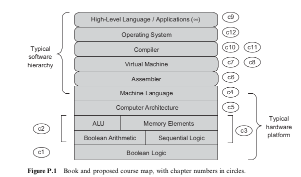
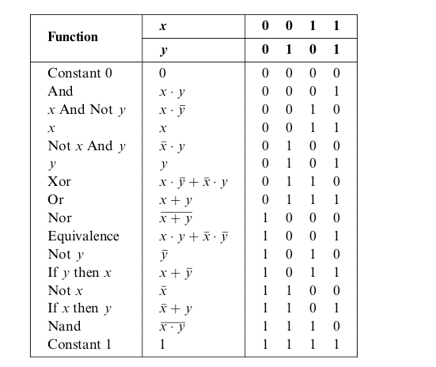
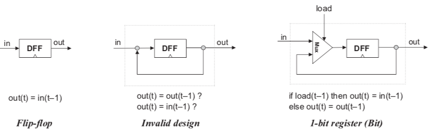
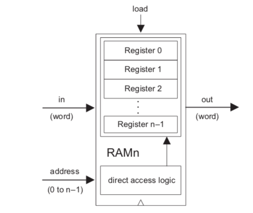
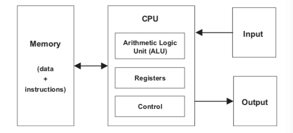
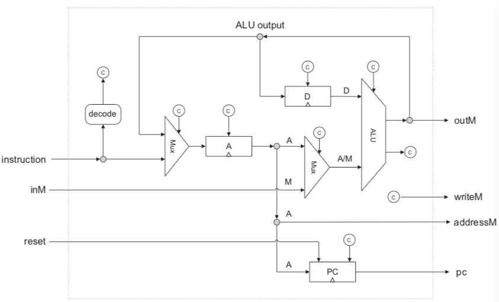

# The elements of Computing Systems

## Preface

* hardware and software systems are tightly interrelated through a hidden web of abstractions, interfaces, and contract-based implementations

* The map of the computing system

* 
  
                                                                                                                                                                                                                                                                                                                                                                                                                                                                           

* In computer science,  we take the notion of abstraction very concretely, defining it to be a statement of what the entity does and ignoring the details of how it does it

## Boolean Logic

* Every Boolean function, no matter how complex, can be expressed using three Boolean operators only: And, Or and Not

* every Boolean function can be constructed from Nand operations alone

* 
  
  

* logic design is the art of interconnecting gates in order to implement more complex functionality, leading to the notion of composite gates
* a multiplexor is a three-input gate that uses one of the inputs called selection bit to select and output one of the other two inputs, called data bits
* a demultiplexor performs the opposite function of a multiplexor, it takes a single input and channels it to one of two possible outputs according to a selector bit 
* computer hardware is typically designed to operate on multi-bit arrays called buses

## Boolean Arithmetic

* The ALU is the centerpiece chip that executes all the arithmetic and logical operations performed by the computer
* most of the operations performed by digital computers can be reduced to elementary additions of binary numbers
* the system can code a total of 2^n signed number, of which the maximal and minimal numbers are 2^(n-1) - 1 and -2^(n-1), respectively
* 2's complement method facilitates the addition of any two signed numbers without requiring special hardware beyond that needed for simple bit-wise addition
* The material implications of these theoretical results are significant, basically, they imply that a single chip, called ALU, can be used to encapsulate all the basic arithmetic and logical operators performed in hardware

## Sequential Logic

* using these flip-flops as elementary building blocks, we will specify and build all the memory deveices emplyed by typical modern computers

* in order to build chips that remembers information, we must first develop some standard means for representing the progression of time

* The elapsed time between the beginning of a tick and the end of the subsequent tock is called cycle, 

* the data flip-flop (DFF) simply outputs the input value from the previous time unit

* Registers, out(t) = out(t-1). register can be implemented from a DFF by simply feeding the output of the latter back into its input

* 
  
  

* RAM

  
  

* In sum, a classical RAM device accepts 3 inputs, a data input, and address input and a load bit, the address specifies which RAM register should be accessed in the current time unit
* a typical CPU includes a program counter whose output is interpreted as the address of the instruction that should be executed next in the current program
* in fact, we allow sequential chips to be in unstable states during clock cycles, requiring only that at the beginning of the next cycle they output correct values
* at the beginning of each clock cycle, the outputs of all the DFF in the computer commit inputs during the previoud time unit, at all other times, the DFFs are latched meaning that changes in their inputs have no immediate effect on their outputs

* the time dependency by simultaneously feeding the master clock signal to all the DFF gates in the platform

## Machine language

* A machine language is an agreed-upon formalism, designed to code low-level programs as series of machine instructions
* a machine language can be viewed as an agreed-upon formalism, designed to manipuldate a memory using a processor and a set of registers
* Memory: a continuous array of cells of some fixed width, also called words, or locations, each having a unique address
* Memory access is a relatively slow operation, requiring long instruction formats, for this reason, processors are equipped with serveral registers

* read from keyboard: they peek some keyboard-oriented memeory device, one chatacter at a time

## Computer Architecture

* The program's code is stored and manipulated in the computer memeory, just like data, becoming software

* the same hardware plarform can be made to behave completely differently each time it is loaded with a different program

* The von Neumann architecture

* 
  
  

* Fetch an instruction word from memory, decode it  and execute it
* Registers: data registers, addressing registers, program counter register
* if the current instruction contains no goto directive, the PC is incremented to point to the next instruction in the program, if the current instruction includes a goto n directive that should be executed, the CPU loads n into the PC
* Memory-mapped IO: each IO device is allocated an exclusive area in memory, becoming its memory map, any program that wants to manipulate this IO device can do so- all it needs to do is manipulate bits int memory(remember the base address)
* each IO device is required to ddfine an interaction contract so that programs can access it correctly

* proposed CPU implementation:

  
  

* the CPU send high-level graphic instructions to a graphics card that controls the screen

## Assembler

* The assembler parses each assembly command into its underlying fields, translates each field into its equivalent binary code, and assembles the generated codes into a binary instruction that can be actually executed by the hardware
* The programmer can use symbolic variable names and the translator will automatically assign them to memory address

## Program Control

* if everythins seems under control, you are just not going fast enough
* behind the subroutine call
  * passing parameters from the caller to the called subroutine
  * saving the state of the caller before switching to execute the called subroutine
  * allocating space for the local variables of the called subroutine
  * jumping to execute the called subroutine
  * returning values from the called subroutine back to the caller
  * recycling the memory space occupied by the called subroutine, when it returns 
  * reinstating the state of the caller
  * Jumping to execute the code of the caller immediately following the spot where we left it
* the only difference between invoking a built-in command and calling a user-defined subroutine is the keyword call preceding the latter
* a return command should be interpreted as follows: redirect the program's execution to the command following the call command that called the current subroutine, wherever this command may be, the memory location of this command is called return address
* we can push the return address on the stack and when we encounter a return command, we can pop the saved return address and simply goto it
* 