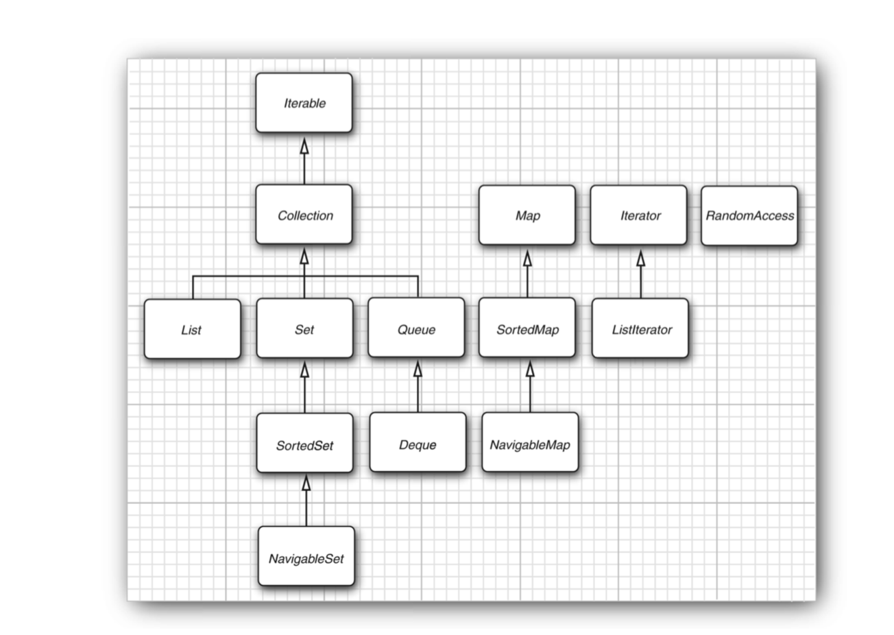

# Java核心编程

## Chapter One Intro
* Simple
	* The syntax for java is a simple version of C++.
	* There is no need for header files, pointer arithmetic, structures, unions, operator overloading, virtual base classes.
	* There is now a separate Java Micro Edition with a smaller library, suitable for embedded device
* Object-Oriented
	* Object-oriented design is a programming language technique that focuses on the data and on the interfaces to that object
* Distributed 
* Robust
	* The jave compiler detects many problems that in other languages would  show up only at runtime
* Secure 
	* Java was designed to make certain kinds of attacks impossible among them
		* Overruning the runtime stack
		* Corrupting memory outside its own process space
		* Reading or writing files without permission
* Architecture-Neutral
	* Virtual machines have the option of translating the most frequently executed bytecode sequences into machine code-a process called just-in-time compilation
* Portable
	* The java librarie do a great job of letting you work in. a platform-independent manner
* Interpreted
* High-Performance
* Multithreaded
* Dynamic
	* Libraries can freely add new methods and instance variables without any effect on their clients

## Chapter Two Environment

* JDK includes the compiler , JRE includes a Java Runtime Environment

* Java Standard Edtion(SE), Java EE(Enterprise Edition), Java ME(Micro Edition)

* the javac program is the java compiler it compiles the file Welcome.java into the file Welcome.class, the java program launches the JVM, ite executes the bytescodes that the compiler placed in the class file

* produce jar file 

  ```java
  jar cvfm RoadApplet.jar RoadApplet.mf *.class
  
  ```

## Chapter Three Fundamentals

* Java is case sensitive
* The keyword public is called an access modifier, these modifiers control the level of access other parts of a program have to this code
* Everything in a Java program must be inside a class
* you need to make the file name for the source code the same as the name of the public class
* the main method must be declared public
* the idea of static member functions in C++, that do not operate on objects, the main method is always static

* Java is strongly typed language, every varibale must have a declared type

### Data Types

* int 4 bytes, short 2 bytes, long 8 bytes, byte 1byte

* float 4 bytes, double 8 bytes, type float have a suffix F or f, 

* three special floating-point values: positive infinity, negatibe infinity, NaN(not a number), dividing a positive number by 0 is positive infinity, computing 0/0 or the square root of a negative number yields NaN, integer division by 0 raises an exception

* x == Double.NaN is never true, if (Double.isNan(x)) // check whether x is not a number

* if you need previse numerical computations without roundoff errors, use the BigDecimal class

* 'A' us a character constant with value 65, "A" a string containing a single character

* unicode escapes sequences are processed before the code is parsed

* char type in java is 16-bit type

* a code point is a code value that is associated with a character in an encoding scheme

* code points U+0000 to U+FFFF, basic mutilingual plane, sixteen additional planes hold the supplementary characters. the supplementary character are encoded as consecutive pairs of code units

* the char type describes a code unit in the UTF-16 encoding, **not to use char type in your progam unless you a re actualy manipulating UTF-16 code units**

* you cannot convert between integers and boolean values

* In Java, it is considered good style to declare variables as closely as possible to the point where they are first used

* the keyword **final** indicates that you can assign to the variable once and then its value is set once and for all

* set up a class constant with the keywords **static final**, if the constant is declared public , methods of other classes can also use it

* methods tagged with the strictfp keyword must use strict floating-point operations that yield reproducible results, **public static strictfp void main(String[] args)**

* **import static java.lang.Math.**, static imports

* you cannot cast betweeen boolean values and any numetic type to prevent common errors, you can use a conditional expression such as b ? 1:0 

* the bitwise operators are & and, |  or, ^ xor, ~ not

* > > > > > > > > > > > > > > > > > ">>>" operator fills the top bits with zero

* Java does not have a common operator, you can use common in the for statement

* enum Size {SMALL, MEDIUM, LARGE}

* Immutable strings have one great advantage, the compiler can arrange that strings are shared

* C++ strings are mutable, you can modify individual chatacters in a string

* test string for equal , **s.equals(t) ** the == operator only determines whether or not the strings are stored in the same location

* java makes strings behave like pointers for equality testing

* null indicates that no object is currently associated with the variable, str == null, str != null && str.length() != 0

* the length method yields the number of code units required for a given string in the UTF-16 encoding

* chatAt return the code unit at position n, n is between 0 and s.length() - 1

* **greeting.CodePoint return the number of code points, offsetByCodePoints**

* str.CodePoints().toArray(), new String(codePoints, 0, codePoints.length)

* StringBuilder is more efficient that the string cancatenation

  ```java
  StringBuilder builder = new StringBuilder()   
  ```

* the Scanner class is defined in the java.util package

* Java SE 6 introduces a Console class specifically for this purpose to read a password

* you can use the static String.format method to create a formatted string without printing it

* for new code you should  use **java.time** package for date and time

* $ specifes the index of the argument to be formatted   

  Sytem.out.printf("%1$s %2$tB %2$te, %2$tY", "Due date:", new Date());

* 
  ```java
  Scanner in = new Scanner(Paths.get("myfile.txt"), "UTF-8")
  PrintWriter out = new PrintWriter("myfile.txt", "UTF-8")w
   write to a file
  ```

* In Java, you may not declare identically named variables in two nested blocks

* javac -Xlint:fallthrough Test.java, issue a warning whenever an alternative does not end with a break statement

* labeled break, read_data: ..... break read_data; // using the babel break the outmost loop

* BigInteger, BigDecimal does the same for floating-point numbers

* int[] a = new int[100];  array , if you frequently need to expand the size of an arrya while your program is running, you should use a different data structure called an array list

* for (variable: collection) statement, for each

* Array.copyOf is often used to increase the size of an array

* In Java program, the name of the program is not stored in the args arrary
* to print out a quick and dirty list of the elements call System.out.println(Arrays,deepToString(a));
* Java has no multidimensional arrays at all ,only one-dimensional arrays


## Chapter four Objects and Classes

* object oriented programming: puts the data first and then looks at the algorithms to operate on the data
* the bits of data in an object are called its instance fields, and the procedures that operate on the data are called its method
* when you invoke a method on an object its state may change
* instances of a class always differ in their identity and usually differ in their state
* A simple rule of thumb in identifying classes is to look for nouns in the problem analysis, methods, on the other hand, correspond to verbs
* Dependence uses a, Aggregation has-a , Inheritance Is-a
* Many programmers use the UML notation to draw class diagrams that describe the relationship between classes
* In the Java programming language, you use constructors to construct new instances
* Constructors always have the same name as the class name, thus the constructor for the Date class is called Date
* an object variable refers to an object, In Java the return value of the new operator is also a reference
* all java objects live on the heap, when an object contains another object variable, it contains just a pointer to yet another heap object
* the Date class represents a point in time the LocalDate class expresses days in the familiar calendar notation
* mutator method, accessor methods(without modifying objects)
* a constructor has the same name as the class, a class can have more than one constructor

* A constructor can only be called in conjunction with the new operator, you cannot apply a constructor to an existing object to reset the instance fields

* **all Java objects are constructed on the heap**

* the keyword this refers to the implicit parameter

* Be careful not to write accessor methods that return references to mutable objects

* ```java
  // unlike LocalDate class, which has no mutator methods, the Date class has a mutator method, setTime
  class Employee
  {
    private Date hireDay;
    public Date getHireDayz()
    {
  		 return hireDay; // bad
    }
  }
  ```

* if you need to return a reference to a mutable object, you should clone it first

* a method can access the private data of all objects of its calss

* if can define an instance field as final, such a field must be initialized when the object is constructed, and the field may not be modified again. 

*  **for mutable classes, the final modifer can be confusing**, it means that the object reference stored in the variable will never again be changed to another object, but the object can be mutated

* **if you define a field as static, there is only one such field per class, it belongs to the class, not to any individual object**

* Static constant  **public static final double PI**, if there is no static, you would need an object to access PI.

* **static methods are methods that do not operate on objects**

  * when a method does not need to access the object state, because all parameters are supplied
  * when a method only needs to access static fields of the class
  * use static factory methods that construct objects, so you can give names to constructors and  you can vary the type of the constructed object.

* **the main method does not operate on any object, so the main method is static**

* the Java always uses call by value,  the method gets a copy of all parameter values, and **object reference are passed by value**

* Overloading occurs if serveral methods have the same name but different parameters, the compiler must sort out which method to call. 

* you must always explicitly initialize local variables in a method, but in a class, if you do not initialize a field, it is automatically initialized to a default

* you can simply assign a value to any field in the class definition

* ```java
  private String name = ""
  ```

  This assignment is carried out before the constructor executes

* if the first statement of a constructor has the form this(…), it just calls. another constructor of the class
* initialize a data field 
  * setting a value in a constructor
  * assigning a value in the declaration
  * Initializing in the object initialization block {...}

* a form of the import statement permits the importing of static methods and fields **import static java.lang.system.***

* to place classes inside a package, you must put the name of the package at the top of your source sill, before the code that defines the classes in the package

* you can compile the file even if it is not contained in a subdirectory, but the JVM will not find the class

* if you do not specify either public or private, the feature can be accessed by all methods in the same package

* if you seal a package, no further classes can be added to it

* a JAR file contains multiple class files and subdirectories in a compressed format, saving space and improving performance

* the javac compiler always looks for files in the current directory, but the JVM will not if the current directory is not on the class path

* you can import nonpublic classes from the current package

* set the class path, and you can also use the CLASSPATH environment variable

* ```
  java -classpath .;; MyProg
  ```

* you can use javadoc to generate HTML documentation from your source files, if you add comments that start with the special delimiter /** to your source code, you can easiy produce prefessional-looking documentation

* to generate the package comments

  * you can supply an HTML file named package.html
  * supply a Java file name package-info.java, with comments delimited with /** */ followed by a package statement

  

## Chapter five Inheritance

* All inheritance in Java is public in inheritance

* you can use the special keyword super to call the children class method

* the constructor parameters are either passed to another constructor of the same class this or a constructor of the superclass

* **the fact that an object variable can refer to multiple actual types is called polymorphism**, and select the appropricatre method at runtime is called dynami binding 

* If the superclass method is public, the subclass method is public, the subclass method must also be declared public

* occasionally, you want to prevent someone from forming a subclass from one of your classes. classes that cannot be extended are called final classes

* all methods in a final class are automatically final

* you can also make a specific method in a class final, then no subclass can override that method

* if you assign a superclass reference to a subclass variable you are promising more then you must use a cast so that your promise can be checked at runtime

* it is good programming practice to find out whether a cast will succeed before attempting it, simply use the **instanceof** operator

  ```java
  staff[i] instanceof Manager
  ```

* Abstract classes cannot be instantiated,  no objects of that class can be created. you can still create object variables of an abstract class but such a variable must refer to an object of a non abstract subclass

* **protected fields and protected methods**, the subclases can be trusted to use the method correctly, but other classes cannot 

* ```
  private: Visiable to the class only 
  pubic: Visiable to the world
  protected: Visiable to the package and all subclasses
  default: Visiable to the package
  ```

* every class in Java extendes Object, only the values of primitive types are not objects

* the call Objects.equals(a, b) return true if both arguments are null, false if only one is null, and calls a.equals(b) otherwise

* equals

  * if subclasses can have their own notion of equality, then the symmetry requirement forces you to use the getClass test
  * if the notion of equality is fixed in the superclass, then you can use the instance test and allow objects of different subclasses to be equal to one another

* use **@Override** to override the superclass method

* a hashcode is an integer that is derived from an object, String class hashcode method

* ```java
  int hash = 0;
  for (int i = 0; i < length(); i++)
      hash = 31 * hash + charAt(i);
  ```

* **the hashCode method is defined in the Object class, that hash code is derived from the object's memory address**

* if you refine the equals method, you will also need to redefine the hashCode method for objects that users might insert into a hash table

  ```java
  public int hashCode()
  {
    return Objects.hash(name, salary, hireDay);
  }
  ```

* toString method is in object, the array type can call the Array.toString, or Array.deepToString for multidimensional arrays

* ArrayList is a generic class with a type parameter, to specify the type of the element objects that the array list holds, you append a class name enclosed in angle brackets such as 

* ```
  ArrayList<Employee> = new ArraryList<>(); // diamond syntax
  ```

* once you are reasonably sure that the array list is at its permanant size, you can call the trimToSize method, this method adjusts the size of the memory block to use exactly as much storage space as is required

* You can suppress warnings using :  @SuppressWarning("unchecked")

* Typed arraylist vs raw arraylist

* All primitive types have class counterparts are called wrappers, and you shold call the equals method when comparing wrapper objects

* List.add(3) == list.add(Integer.valueOf(3)).  is called **autoboxing**

* Integer objects are also immutable, the information contained inside the wrapper cannot change

* printf(String fmt. Object … args) the object … parameter types is the same as Object[]

* define enum 

* ```java
  enum Size
  {
     SMALL("S"), MEDIUM("M"), LARGE("L"), EXTRA_LARGE("XL");
  
     private Size(String abbreviation) { this.abbreviation = abbreviation; }
     public String getAbbreviation() { return abbreviation; }
  
     private String abbreviation;
  }
  ```

* a program that can analyze th capabilities of classes is called reflective

* **the getClass method in the Object class return an instance of Class type**

* int.class is nevertheless the object of type Class

* get the class from string, if the loading class in main is too slow, you can use this to loading the class

  ```java
  String className = "java.util.Random"; 
  Class cl = Class.forName(className);
  ```

* the virtual machine manages a unique Class object for each type, so you can use  == operator to compare class objects

* Class.forName(s).newInstance() to get the instance using empty constructor

* the ObjectAnalyzer keeps track of objects that were already visited,

* ```java
  new ObjectAnalyzer().toString(squares);
  ```

* The Array class in the jave.lang.reflect package allows you to create arrays dynamically

* the Method class has an invokemethod that lets you call the method that is wrapped in the current Method object

* **do not use protected fields**

* **use polymorphism not type information**

## Chapter 6 Interfaces

* interfaces is a way of describing what classes should without specifying how they should do it

* an interface is not a class but a set of requirements for the classes that want to conform to the interface

* any class that implements the Comparable interface is requird to have compareTo method

* all methods of an interface are automatically public, fields are always public static final

* interfaces can also define constants, never have instance fields

* the reason for interfaces is that the Java programming language is strongly typed

* if there is a common algorithm for comparing subclass objects, simply provide a single compareTo method in the superclass and declare it as final

* sgn(x.compareTo(y)) == -sgn(y.compareTo(x)) 

* even though you cannot construct interface object, you can still declare interface variables

* classes can implement multiple interfaces

* interfaces afford most of the benefits of multiple inheritance while avoiding the complexities and inefficiencies

* you are allowed to add static methods to interfaces, so no reason to provide a separate companion class for utility methods

* you can supply a default implementation for any interface method, you must tag such a method with the default modifier

* an important use for default methods is interface evolution

* superclass > interface default method, the class wins

* callback pattern, you can pass an object of a class that implements the specific interface

* a comparator an instance of a class that implements the Comparator interface

* ```java
  class LengthComparator implements Comparator<String>
  {
      public int compare(String first, String second)
      {
          return first.length() - second.length();
      }
  }
  ```

* the Cloneable interface is a tagging interface, which is to allow instance of Cloneable

* you can supply a lambda expression whenever an object of an interface with a single abstract method is expected, such an interface is called a functional interface

* a particularyly usefule interface in the jave.uti.function package is Predicate

* method reference, object::instanceMethod, Class::staticMethod, Class::instanceMethod

* constructor reference, int[]::new, x -> new int[x]

* In Java, lambda expressions are closures

* when you use the this keyword in a lambda expression, you refer to the this parameter of the method that creates the lambda

* the most important functional interface that are provided in the Java API, we can use the Runnable interface

* Arrays.sort(people, Comparator.comparint(Person::getName))

* an object that comes from an inner class has an implicit reference to the outer class object that instantiated it, static inner classes do not have this added pointer

* an inner class cannot have static methods

* any static fields declared in an inner class must be final

* Gets class of static method: new Object(){}.getClass().getEnclosingClass()

* use a static inner class whenever the inner class does not need to access an outer class object


## chapter 7 Exceptions

* an exception object is always an instance of a class derived from Throwable
* you declare that your method may throw an exception with an exception specification in the method header
* if the superclass method throws no checked exception at all,, neither can the subclass
* you are not allowed to add more throws specifiers to a subclass method Thant are present in the superclass method
* e.getMessage() to get the detailed message of the exception
* e.getClass().getName() to get the actual type of the exception object
* using se.initCause(e) to set the initial cause of the exception
* we strongly suggest that you decouple try/catch and try/finally blocks, this makes your code far less confusing
* use th try-with-resources statement whenever you need to close a resource
* throw early, catch late
* you can use **ea da** to enable or disable assertions

* it is also possible to change logging levels in a running program by using the console program
* you ca use jmap utility to get a heap dump that shows you every object on th heap
* you can launch the Java Virtual Machine with the -Xprof flag, it runs a rudimentary profiler that keeps track of the methods in your code that were executed most often
* if you launch the JVM with the -Xprof flag, it runs rudimentary profiler that keeps track of the methods in your code 


## chapter 8 Generic Programming

* T extends Comparable & Serializable, T is a subtype of Comparable

* Bridge methods ar synthesized to preserve polymorphism

* There are no generics in the virtual machine, only ordinary classes ad methods

* Bridge methods are synthesized to preserve polymorphism

* type parameters cannot be instantiated with primitive types

* Objects in the JVM always have a specific nongeneric type

* You cannot instantiate arrays of parameterized types, such as 

  Pair<String>[] table = new Pair<String>[10];

* static fields and methods with type variables are simply outlawed
* a class or type variable may not at the same time be a subtype of two interface types which are different parameterization of the same interface

* there is no inheritance relationship between pair classes
* arrays come with special protection, if you try to store a lowly employee into employeeBuddies[0], the VM throws an ArrayStoreException
* Pair<Employee> is a subtype of the raw type Pair, this conversion is necessary for interfacing with legacy code
* wildcard type:  Pair<? extends Employee>, Pair(raw), Pair<? extends Employee,Pair<Manager>, Pair<Employee>
* wildcards with supertype bounds let you write to a generic object, while wildcards with subtype bounds let you read form a generic object
* String.class is actually an object of the class Class<String>


## Chapter 9 Collections

* the two commono implementations of queue, one use a circular array and one uses a linked list

* For Java SE 8, you can call the forEachRemainning method with a lambda expression that consumers an element

* the Collections interface

* <div align="center">  </div><br>

* the interface has no methods but you can use it to test whether a particular collection supports efficient random access
* this position dependent add method is the responsibity of an iterator
* unlike the add method, which depends only on the iterator position, the remove method depends on the iterator state
* the colletions keeps track of the number of mutating operations, eaach iterator keeps a separate count of the number of mutating operations that it was responsible for
* all methods of the Vector class are synchronized it is safe to access a Vector object from two threads
* View: implements the Set interface and whose methods manipulate othe original map, such a collection is called a view


## chapter 13

* use the jar tool to make JAR files

* ````
  jar cvf JARFileName File1 File2...
  ````

* in addition to class files, images, and other resources, each JAR file contains a manifest file that describes special features of the archive

* to edit the manifest 

* ```
  jar cfm JARFileName ManifestFileName
  ```

* you can specify the main class of your progarm in the manifest

* start the progam

* ```
  java -jar MyProgram.jar
  ```

* resources

* ```java
  URL url = ResourceTest.class.getResource("test.gif");
  Image img = new ImageIcon(url).getImage();
  ```

* sealing

* ```
  Name: com/mycompany/util/
  Sealed: true
  ```

* the program remembers the frame position, size and tiles in properties

* if you store complex configuration information, you should use the Preferences class instead

* service loader

* ```java
  public static ServiceLoader<Cipher> cipherLoader = ServiceLoader.load(Cipher.class);
  ```

## Chapter 14 Concurrency

* each process has a complete set of its own variables, threads share the same data, communication between threads more efficient and easier to program than interprocess communication, threads are more lightweight than processes

* the **interrupted** method clears the interrupted status of the thread

* daemon threads are sometimes mistakenly, and it should never access a persistent resource such as a file or database since it can terminate at any time

* there are now better features for operating on collections of threads, we recommend that you do not use thread in your program

* You can actually peek at the virtual machine bytecodes that execute each statement in our class, 

  ```
  javap -c -v Bank
  ```

* private Lock bankLock = new ReentrantLock(); // ReentrantLock implements the Lock interface

* a lock object can have one or more associated condition objects, you obtain a condition object with the newCondition method

* a thread can only call await, signalAll, or signal on a condition if it owns the lock of the condition

* if a method is declared with the synchronized keyword, the object's lock protects the entire method

* ```java
  public synchronized void method()
  ```

* intrinsic lock and conditions have some limitations:

  * You cannot interrupt a thread that is trying to acquire lock
  * You cannot sepcify a timeout when trying to acquire a lock
  * having a single condition per lock can be inefficient

* block,  synchronized(obj) { critical section }  
* the volatile keyword offers a lock-free mechanism for synchronizing access to an instance field
* the AtomicInteger class has methods incrementAndGet and decrementAgdGet that atomically increment or decrement an integer
* if you have a very large number of threads: using LongAdder and LongAccumulator
* what is one to do with a map that has over two billion entries, Java SE 8 introduces a mappingCouunt method that returns the size as a long
* the futureTask wrapper is a convenient mechanism for turning a Callable into both a Future and a Runnable
* 

