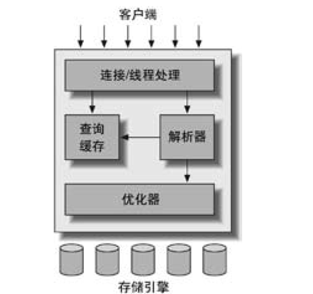
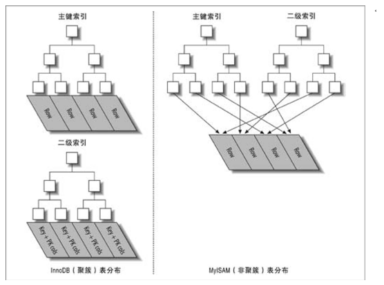
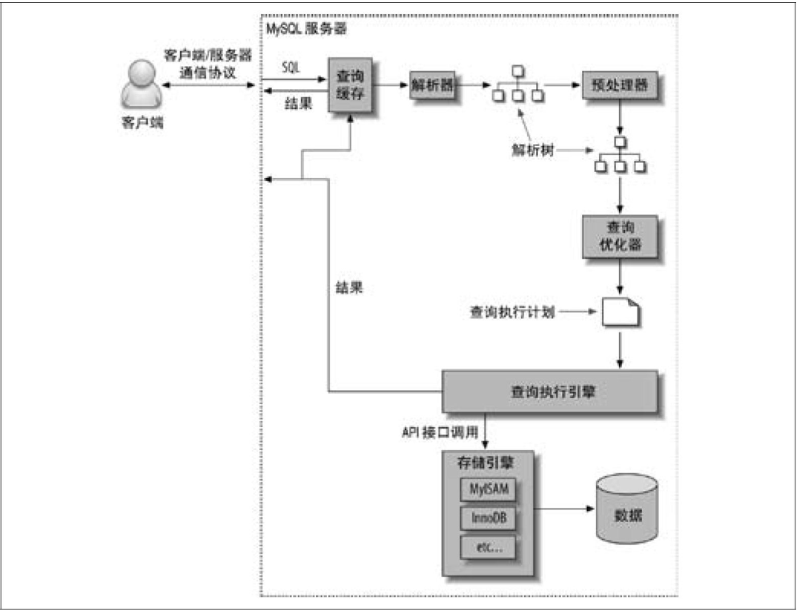
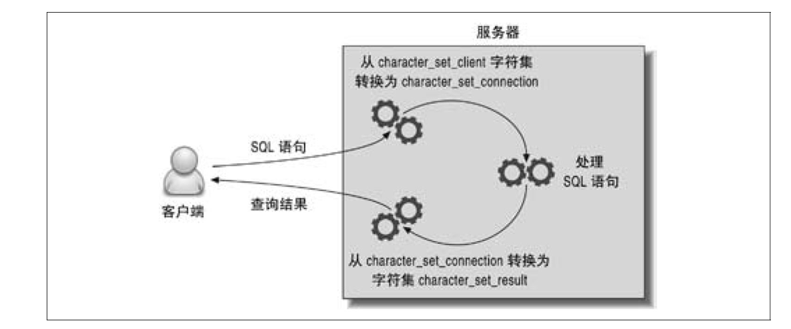

## 第一章

* MySQL最重要，最与众不同的特性是它的存储引擎架构，这种架构的设计将查询处理以及其他系统任务和数据的存储/提取相分离

MySQL服务器逻辑架构图


<div align="center">  </div><br>

* 最上层的服务不是MySQL所独有的，大多数基于网络的客户端/服务器的工具
* 第二层架构提供核心的服务功能都在这一层，包括查询解析，分析，优化，所有跨存储引擎的功能都在这层实现：存储过程，触发器，视图等
* 第三层包含了存储殷勤，负责MySQL中数据的存储和提取，存储引擎API包含几十个底层函数，用于执行开始一个事务等操作
* 服务器会负责缓存线程，因此不需要为每一个新建的连接创建或者销毁线程
* 每个客户端连接都会在服务器中拥有一个线程，这个连接的查询只会在这个单独的线程中，该线程只能轮流在某个CPU核心中运行
* MySQL会解析查询，并创建解析树，对其进行优化，重写查询，决定表的读取顺序，以及选择合适的索引
* 优化器并不关心表使用的是什么存储引擎，但是优化器会请求存储引擎提供容量或者某个具体操作的开销信息，以及表数据的统计信息等
* 对于SELECT语句，在解析查询之前，服务器会检查cache
* 在处理并发可以通过锁来实现，共享锁和拍他锁，读锁和写锁
* 任何时候，在资源上，锁定的数据量很少，则系统的并发程序越高，不冲突即可
* 尽管存储殷勤可以管理自己的锁，MySQL还是会使用各种有效的表锁来实现不同的目的
* InnoDB和XtraDB，以及其他的一些存储引擎中实现了行锁，行锁只存在存储引擎中，而MySQL服务器中没有实现

### 事务

* ACID，原子性，一致性，隔离性，持久性
* 即使存储引擎不支持事务，也可以通过LOCK TABLES语句为应用提供一定程度的保护

* 隔离级别:
  * READ UNCOMITTED，事务的修改，没有提交，对其他的事务也是可见的，事务可以读取未提交的数据，脏读，实际很少使用
  * READ COMMITED（不可重复读），一个事务，只能看见已经提交的修改，但是可能会读取到不一样的结果
  * REPEATABLE READ（可重复读），保证了同一个事务中多次读取同样的记录结果是一致的，但是无法解决幻读，InnoDB通过多版本并发控制MVCC，解决了幻读问题，
  * SERIALIZABLE 可串行化，强制串行执行
* 死锁发生，只有部分或者完全回滚其中一个事务，才能打破，应用程序需要考虑如何处理死锁的问题，大多数时候只要重新执行因死锁回滚的事务即可, 目前InnoDB目前处理的方法是，将持有最少行级排他锁的事务进行回滚
* 使用事务日志，可以把修改行为持久化到硬盘上的日志，不用将数据持久到硬盘，事务日志持久化之后，内存中的数据可以在后台慢慢的刷回到硬盘，
* 如果不是显式地开始一个事务，则每个查询都被当作一个事务执行提交操作，在当前连接中可以通过AUTOCOMMIT去启用或者禁用自动提交模式
* 还有一些命令，在执行之前会强制执行COMMIT提交当前的活动事务。
* SET SESSION TRANSACTION ISOLATION LEVEL READ COMMITED; 设置隔离级别
* InnoDB采用的是两阶段锁定协议，在事务执行过程中，随时都可以执行锁定，锁只有在执行COMMIT或者ROLLBACK的时候才会释放，并且都是同一个时刻释放
* InnoDB支持通过特定的语句进行显示锁定，SELECT…FOR UPDATE, SELECT … LOCK IN SHARE MODE
*  除了事务中禁用了AUTOCOMMIT，可以使用LOCK TABLES之外，其他时候不要现实的执行LOCK TABLES


### 并发控制

* MVCC是行级锁的变种，它在很多情况都避免了加锁，因此开销更低，大都实现了非阻塞的读操作，写操作也只是锁定特定的行
* InnoDB通过在每行记录后面保存两个隐藏的列，保存行的创建时间和过期时间，存储的是系统版本号，每开始一个新的事务，系统版本号都会自动递增
* MVCC只在可重复读和不可重复读两个级别下面工作


### 存储引擎

* 在文件系统中，MySQL将每个数据库保存为数据目录下的一个子目录, 数据库子目录下创建一个和表同名的frm文件保存表的定义，不同的存储引擎保存数据和索引的方式是不同的，但是表的定义则是在MySQL服务层统一处理的
*  show table status like 'user' 显示表的相关的信息，对于MyISAM，行的格式有Dynamic，Fixed和Compressed，表中的行数，对于MyISAM和其他一些存储引擎，该值是精确的，但是对于InnoDB，该值是估计值
* InnoDB被设计用来处理大量的短期事务，短期事务大部分情况下是正常提交的
* InnoDB的数据存储在表空间中，表空间是由InnoDB管理的一个黑盒子，由一系列的数据文件组成
* InnoDB采用MVCC来实现支持高并发，并且通过间隙锁策略防止幻读，间隙锁是的不仅锁定涉及的行，还会对索引中的间隙进行锁定，防止幻影行的插入
* InnoDB的存储格式是平台独立的，可以将数据和索引文件从Intel平台到其他平台
* InnoDB表是聚簇索引建立的，对主健有很高的性能，但是二级索引必须包含主键列，所以主键应该尽可能的小
* InnoDB通过一些机制和工具支持真正的热备份

* 自适应哈希索引，以及加速插入操作的插入缓冲区
* InnoDB会解析外键的定义，因为MySQL本身没有实现该功能


#### MyISAM

- 对于只读的数据，或者表比较小，可以忍受修复操作，可以依然继续使用MyISAM
- MyISAM 将表存储在两个文件中：数据文件和索引文件，分别以.MYD 和.MYI为扩展名
- MyISAM表可以包含动态或者静态行，会根据表的定义来决定何种格式
- 可以通过修改表的MAX-ROWS和AVG-ROW-LENGTH选项的值来实现，两者相乘就是可能达到的最大大小
- MyISAM对整张表加锁，不是针对行，读取时会加共享锁，写入时则加排他锁，但是在表有读取的同时，也可以往表中插入新的纪录，并发插入
- 可以通过CHECK TABLE mytable检查表的错误，有错误可以通过执行REPAIR TABLE mytable 进行修复
- 如果制定了DELAY_KEY_WRITE选项，每次修改执行完成时，不会立刻将修改的索引数据写入磁盘，而是会写到内存中的键缓冲区，只有在清理键缓冲区或者关闭表的时候才会，将索引块写入到磁盘
- MyISAM压缩表，可以使用myisampack对表进行压缩，压缩表可以提升查询性能，支持索引，索引也是只读的
- 如果不在乎可扩展能力和并发能力，也不在乎崩溃后的数据丢失问题，对InnoDB的空间占用过多比较敏感，这种场合选择MyISAM就比较合适
- 除非不得已，不建议混合使用多种存储引擎


#### 引擎转换

* ALTER TABLE mytable ENGINE=InnoDB, 需要执行很长时间，失去原引擎的所有的相关特性。
* CREATE TABLE innodb_table LIKE myisam_table; ALTER TABLE innodb_table ENGINE=innoDB; INSERT INTO innodb_table SELECT * FROM misaim_table;,数据很多的话，可以分批处理


## 第二章

### 基准测试


* 基准测试是唯一方便有效的，可以学习系统在给定的工作负载下会发生什么的方法，以观察系统在不同压力下的行为，评估系统容量

* Sys bench, 这是一款非常优秀的MySQL基准测试工具

* 很多都会影响基准测试，比如数据量，数据和查询的分布，但最重要的还是基准测试通常要求尽可能地执行完成，所以通常给系统带来过大的压力

* 这个系统的测试 full-stack，组件测试 single-component

* 整体应用的集成试验测试更能揭示应用的真实表现

* 吞吐量值得是单位时间内的事务处理数，常用的测试单位是每秒的事务数TPS，有些也采用TPM

* Web服务器的并发性更准确的度量指标，应该是任意时间有多少同时发生的并发请求

* 在系统的业务压力可能发生变化的情况下，测试可扩展性就非常必要了

* 基础测试应该运行足够长的时间，如果需要测试稳定状态时的性能，那么当然需要在稳定的状态下测试并观察

* 可以通过pt-diskstats工具捕获 /proc/diskstats/ 的数据为后续分析磁盘I/O使用

* 一个数据的碎片度和在磁盘上的分布，都可能导致测试时不可重复的，一 个确保物理磁盘数据的分布尽可能一致的办法是每次都进行快速格式化并进行磁盘分区复制

* 脚本的输出都可以定制为gnuplot或者R绘图的数据来源，gnuplot，

* mysqlslap，可以模拟服务器的负载，并且输出计时信息

* MySQL Benchmark Suite，在不同数据库服务器上进行比较测试

* Super Smack，Database Test Suite，Perconna's TPCC_MySQL Tool

* sysbench 是一款多线程系统压测工具，可以根据影响数据库服务器性能的各种因素来评估系统的性能

* MySQL中有一个内置的BENCHMARK函数，可以测试某些特定操作的执行速度

  ```mysql
  ​```
  set @input := 'hello world';
  select benchmark(1000, MD5(@input));
  ​```
  ```

* http_load -rate 5 -seconds 10 urls.txt
* MySQL 基础测试套件是由Perl开发的基准测试工具

### sysbench

* 安装sysbench

  ```
  curl -s https://packagecloud.io/install/repositories/akopytov/sysbench/script.rpm.sh | sudo bash
  sudo yum -y install sysbench
  ```

* 测试

* ```bash
  	sysbench --test=cpu --cpu-max-prime=20000 run
    	
    	sysbench --test-fileio --file-total-size=150G prepare # 	创建数据集
    	# seqwr, seqrewr, seqrd,rndrd, rndwr, rdnrw
    	sysbench --test=fileio --file-total-size=150G --file-test-mode=rndrw --init-rng=on -max-time=300 --max-requests=0 run
    	
    	sysbench --test=oltp --oltp-table-size=1000000 --mysql-db=test --mysql-user=root prepare
    	sysbench --test=oltp --oltp-table-size=1000000 --mysql-db=test --mysql-user=root --max-time=60 --oltp-read-only=on --max-request=0 --num-threads=8 run
  ```


## 		第三章

* 数据库服务器的性能用查询的响应时间来度量，单位是每个查询花费的时间

* 对查询的优化可以让服务器每秒钟执行更多的查询，因为每条查询执行的时间更短了

* 完成一项任务所需要的时间可以分成两部分，执行时间和等待时间，如果是要优化执行时间，最好的办法是通过测量定位不同的字任务话费的时间，然后去优化子任务，而优化任务的等待时间，更复杂，可能要去查看系统

* 当基于执行时间的分析发现一个任务需要花费太多时间的等待，应该去分析一下，可能有些执行时间实际上也是在等待，例如上面简单的性能剖析的输出显示表在SELECT查询话费了大量时间，可能发现时间都花费在等待IO完成

* MySQL就是一个典型的例子，直到版本5.5才第一次提供了performanche Schema

* 性能剖析无法显示所有的时间分布，**只相信平均值是危险的**，要提供更多的时间的信息，比如直方图，百分比，标准差等

* **建议在所有的新项目中都考虑包含性能分析的代码**

* New  Relic会插入到应用程序中进行性能剖析，将收集到的数据发送到一个基于Web的仪表盘，更容易利用面向响应时间的方法分析应用性能

* MySQL的企业监控器，也是值得考虑的工具之一，这个Oracle提哦那个的MySQL的服务之一，可以捕获发送给服务器的查询

* 在MySQL中，满查询日志是开销最低，精度最高的测量查询时间的工具，不过要担心日志可能要消耗大量的磁盘空间，如果长期开启慢查询日志，需要部署日志轮转的工具

* 离差指数高的查询对应的执行时间的变化大，这类查询通常都值得去优化

* 可以通过慢查询日志记录查询或者使用**pt-query-digest**分析tcpdump的结果

* Percona Server 提供了慢查询的更详细的信息

* show profile 当一条查询提交给服务器的时候，会记录信息到一张临时表，SHOW PROFILE 命令无法通过order by命令重新排序，我们如果直接查询INFORMATION_SCHEMA中对应的表，就可以格式化输出

  ```mysql
  SET profiling = 1;
  SELECT * FROM text_monitor.user;
  SHOW PROFILES; 
  SHOW PROFILE FOR QUERY 1；
  ```

* SHOW STATUS的大部分结果都只是一个计数器，可以显示某些活动如读索引的频繁程度

* SHOW STATUS 和 SHOW GLOBAL STATUS，需要注意变量是会话级别的还是全局级别的

* ```mysql
  SHOW STATUS WHERE Variable_name LIKE 'HANDLER%' OR Variable_name like 'Created%;
  ```

* EXPLAIN只是查看查询的执行计划也可以获得大部分相同的信息，但是无法告诉你临时表是否是磁盘表还是内存临时表

* 使用performance_schema 查询系统等待的主要原因

* ```mysql
  SELECT event_name, count_stat, sum_timer_wait FROM events_waits_summary_global_by_event_name ORDER BY sum_timer_wait DESC LIMIT 5;
  ```

* 利用SHOW GLOBAL STATUS通过计数器去发现问题

* ```bash
  mysqladmin ext -i1 | awk '/Queries/{q=$4-qp;qp=$4} /Threads_connected/{tc=$4} /Threads_running/{printf "%5d %5d %5d\n", q, tc, $4}'
  ```

* 通过不停地捕获SHOW PROCESSLIST的输出，来观察是否有大量的线程处于不正常的状态，例如查询很少会出现statistics的状态，这个状态一般指服务器在查询优化的阶段如何确定表的关联的顺序,利用 sort|uniq -x | sort的一类命令来计算某个列出现的次数

* 对于等待分析， 常用的方法是GDB的堆栈跟踪，先启动gdb然后，attach到mysql进程

* **可用于服务器内部诊断的一个重要工具是oprofile，也可以使用strace剖析服务器的系统调用**

* 可以查找使用的最多的或者最少的表和索引，通过读取次数或者更新次数，找出从未使用过的索引删除掉，看卡复制用户的CONNECTED_TIME和BUSY_TIME，确认复制是否很难跟上主库的进度

  ```mysql
  SHOW TABLES FROM INFORMATION_SCHEMA LIKE "%_STATISTICS"
  ```

* 使用strace可以调查系统调用的情况

  ```bash
  strace -cfp $(pidof mysqld)
  ```

* 可以利用iostat输出磁盘的读写情况

* ```bash
  iostat 
  ```

* 当一个资源的效率变得低下时候，有如下可能的原因

  * 资源被过度使用，余量已经不足以正常工作
  * 资源没有被正确的配置
  * 资源已经损坏或者失灵

## 第四章

* 优化数据类型：

  * 更小的通常更好，占用更小的磁盘，内存和CPU缓存
  * 简单就好，整型比字符操作代价更低，字符集和校对更复杂
  * 尽量避免使用NULL，查询中包含NULL，对于MySQL来说更能优化
  * 在列上建立索引尽量避免NULL的出现

* DATETIME和TIMESTAMP都可以存储相同的类型的数据，当时TIMESTAMP只使用DATETIME一半的存储空间，并且会根据时区变化，TIMESTAMP允许的时间范围要小很多

* 对于存储和计算来说，INT(1)和INT(20)是相同的

* Decimal类型用于存储精确的小数，在MySQL或更高的版本，Decimal支持精确计算，因为CPU不支持对Decimal的直接计算，MySQL服务器自身实现了Decimal的高精度计算，因为CPU支持原生浮点计算，速度更快

* FLOAT使用四个字节存储，DOUBLE存储占用8个字节

* 能选择的只是存储类型，MySQL使用DOUBLE作为内部浮点计算的类型

* 因为需要使用额外的空间和计算开销，尽量在小数进行计算的时候采用Decimal

* 在数据量比较大的时候，可以考虑使用BIGINT代替DECIMAL，避免浮点数存储计算不准确和DECIMAL精确计算代价高

* VARCHAR和CHAR的存储和存储引擎有关

* VARCHAR类型可用于存储变长字符串，比定长类型更节省空间，如果MySQL使用ROW_FORMAT=FIXED创建的话，每行都会使用定长存储

* VARCHAR需要使用1或2个额外的字节记录字符串的长度，一个VARCHAR(10)的列需要使用11个字节的存储空间

* VARCHAR节省了存储空间，但是由于行是变长的，在UPDATE的时候可能需要额外的工作，例如MyISAM会将拆成不同的字段存储，InnoDB则需要分裂页使得可以放进页内

* InnoDB则更灵活，过长的VARCHAR存储为BLOB

* 对于经常需要变更的数据，CHAR比VARCHAR更好，因为CHAR类型不容易产生碎片

* 当存储CHAR值时，MySQL会删除所有的末尾空格

* MySQL填充BINARY采用的是\0而不是空格，在检索是也不会去掉填充值

* 填充和截取空格的行为在不同的存储引擎都是一样的，因为这是在MySQL服务器进行处理的

* 在BLOB和TEXT的值太大时，InnoDB会使用专门的外部存储区域来进行处理，此时每个值在行内需要1-4个字节存储一个指针，然后在外部存储区域存储实际的值

* MySQL对BLOB和TEXT排序和其他类型不同，只对每个列的最前面的max_sort_length字节而不是整个字符串排序

* 临时表的大小超过max_heap_table_size或tmp_table_size超过之后MySQL会把内存临时表转化为MyISAM磁盘临时表

* MySQL的枚举字段是按照内部存储的整数而不是定义的字符床进行排序的，另外也可以在查询中使用FIELD函数显式的指定排序顺序，这样会导致MySQL无法利用索引消除排序

* 枚举最不好的地方是，字符串列表是固定的，添加或者删除字符串必须使用ALTER TABLE

* InnoDB表，如果表上又其他索引，减少主键大小会使非主键索引也变得更小

* 这是一个通用的设计实践，在查找表的时候采用整数主键，而避免采用基于字符串值进行关联

* TIMESTAMP只使用四个字节的存储空间，而DATETIME是八个字节，只能表示从1970到2038年

* 如果需要存储比秒更小粒度的日期和时间，则可以使用BIGINT或者DOUBLE存储秒之后的小数部分

* 应该谨慎的使用BIT类型，如果想在一个bit的存储空间存储true false，就可以创建一个为空的CHAR列，可以保存空值后者长度为零的字符串

* 为标志列选择数据类型时候，应该选择跟关联表中的对应列一样的类型，不仅要考虑存储类型，还要考虑MySQL对这种类型怎么执行计算和比较

* 如果可能尽量避免使用字符串作为标识列，很消耗空间而且比数字类型慢，对于完全随机的字符串也需要多加注意，这些函数的值会任意分布在很大的空间内，会导致INSERT以及SELECT很慢，但是对于很大的表可以消除热点

* 如果存储UUID的值，可以移除-符号，使用UNHEX函数转换UUID的值为16字节的数字，存储在一个BINARY 16 的列中，检索是可以通过HEX函数来格式化为十六进制格式

* 所以应该使用无符号整数去存储IP地址，32位无符号整数

* 如果希望查询执行的快速而且并发性好，单个产讯最好在12个表以内做关联

* 从行缓冲中将编码过的列转换成行数据结构的操作代价非常高

* 范式化设计的schema的缺点是通常是需要关联，稍微复杂的查询语句在符合范式的schema上都可能需要至少一次关联，也许更多，这不但代价昂贵，也可能使得一些索引策略无效

* 计数器

* ```mysql
  INSERT INTO daily_hit_counter(day, slot, cnt) VALUES(CURRENT_DATE, RAND()*100,1) ON DUPLICATE KEY UPDATE cnt = cnt + 1;
  ```

* 所有的MIODIFY COLUMN 都会导致表的重建，另一种方法是通过ALTER COLUMN，这将直接修改frm文件而不设计表的数据

* 修改frm文件

* ```mysql
  FLUSH TABLES WITH READ LOCK;
  UNLOCK TABLES; 释放锁
  ```

  * 移除一个列的AUTO_INCREMENT属性
  * 增加，移除或者更改Enum和SET常量，如果移除的是已经有行数据用到其值的常量，查询将会返回一个空字符串值


## 第五章

* 索引可以包含多个列，那么列的顺序也很重要，因为MySQL只能高效地使用索引的最左前缀列

* 在MySQL中，索引是在存储引擎层而不是服务器层实现的，不同的存储引擎索引的工作方式不同

* MyISAM使用前缀压缩技术使得索引更小，但是InnoDB按照原数据格式进行存储，MyISAM索引通过数据的物理位置饮用被索引的行，而InnoDB则根据主键引用被索引的行

* 索引查询中，如果某个列有范围查询，则其右边的所有的列都无法使用索引优化查询

* InnoDB引擎有一个特殊的功能，叫做自适应哈希索引，当InnoDB注意到某些索引值被使用的非常频繁时，就会在内存中基于B-Tree索引之上在创建一个哈希索引

* 创建触发器

  ```
  CREATE TRIGGER psedudohash_crc_ins BEFORE INSERT ON pseudohash FOR EACH ROW BEGIN
  SET NEW.url_crc=crc32(NEW.url);
  END;
  
  CREATE TRIGGER psedudohash_crc_ins BEFORE UPDATE ON pseudohash FOR EACH ROW BEGIN
  SET NEW.url_crc=crc32(NEW.url);
  END;
  ```

* 全文索引是一种特殊类型的索引，它查找的是文本中的关键词，而不是直接比较索引中的值

### 索引的优点

* 索引大大减少了服务器需要扫描的数据量

* 索引可以帮助服务器避免排序和临时表

* 索引可以将随机IO变成顺序IO

### 索引策略

* 如果查询中的列不是独立的，则MySQL就不会使用索引，独立的列指的是索引列不能是表达式的一部分，也不能是函数的参数

* 我们应该总是将索引列单独放在比较符号的一侧

* MySQL无法使用前缀索引做ORDER BY和GROUP BY，

* 

* 如果EXPLAIN中有索引合并，应该检查一下查询和表的结构，看是不是已经是最优的了，可以通过参数optimizer_switch来关闭索引合并功能，也可以使用IGNORE INDEX提示让优化器忽略掉某些索引

* 尽管关于选择性和基数的经验法则值得去研究和分析，但是一定要记住别忘了WHERE子句中的排序，分组和范围条件等其他因素

* 聚簇索引并不是一种当读的索引类型，而是一种存储方式，它的数据实际上存放在索引的叶子页中

* 聚簇索引的每一个叶子节点都包含了主键值，事务ID，用于事务和MVC的回滚指针以及所有的剩余列

* 聚簇索引和非聚簇索引的对比图

  

* <div align="center">  </div><br>


* 对于高并发工作负载，主键的上界可能会成为热点，如果遇到这个问题，可能会需要重新设计表或者应用，或者更改innodb_autoinc_lock_mode配置
* MySQL有两种方式可以生成有序的结果，通过排序操作或者按照索引顺序扫描，入股EXPLAIN出来的type列的值为index，那么说明MySQL使用了索引扫描来做排序
* 按照索引顺序读取数据的速度通常要比顺序地全表扫描慢，尤其是在IO密集型的工作负载时
* 如果查询需要关联多个表，则只有表ORDER BY子句引用的字段全部时第一个表时，才能使用索引做排序
* 可以在CREATE TABLE语句中指定PACK_KEYS参数来控制索引压缩的方式
* MySQL的惟一限制和主键限制都是通过索引实现的
* 对于InnoDB来说，逐主键列已经包含在二级索引中了，所以这也是冗余的
* 表中的索引越多插入速度会越慢，一般来说，增加新索引会导致INSERT，UPDATE，DELETE等操作的速度变慢
* 通过查询INFORMATION_SCHEMA.INDEX_STATISTICS就能查到每个索引的使用频率
* **InnoDB在二级索引上使用共享锁，但时访问主键索引需要排他锁，这消除了使用覆盖索引的可能性，并且使得SELECT FOR UPDATE 比LOCK IN SHARE MODE 或非锁定查询要慢**
* 对于范围条件查询，MySQL无法在使用范围列后面的其他索引列了，对于多个等值的条件查询则没有这个限制
* 通过使用覆盖索引查询返回需要的主键，再根据这些主键关联原表获得需要的行，这可以减少MySQL扫描那些需要丢弃的行数
* 如果存储引擎向优化器提供的扫描行数时不准确的数据，或者执行计划本身太复杂，那么优化器会使用索引统计信息来估算扫描行数
* InnoDB会在表首次打开，或者执行ANALYZE TABLE或者表的大小发生非常大的变化的时候计算索引的统计信息
* 只要SHOW INDEX查看索引统计信息，就一定会出发统计信息的更新，可以关闭innodb_stats_on_metadata来避免上面的问题
* lock in share mode适用于两张表存在业务关系时的一致性要求，for  update适用于操作同一张表时的一致性要求。
* 碎片的处理，可以执行OPTIMIZE TABLE或者导出再导入的方式来重新整理数据


## 第六章

* 全表扫描，索引扫描，范围扫描，唯一索引扫描，常熟引用，速度从慢到快

* 一般MySQL能够使用如下三种方式应用where条件，从好到坏依次是：

  * 在索引中使用where来过滤不匹配的记录，这是在存储引擎层完成
  * 使用索引覆盖扫描，在extra中有using index，直接从索引中过滤不需要的记录，并返回命中的结果这是在MySQL服务器层完成
  * 从数据表中返回数据，这在MySQL服务器层完成，需要从数据表中读出记录然后过滤

* 查询路径，MySQL架构有多个层次组成，在服务器层有查询优化器，却没有保存数据和索引的统计信息，统计信息由存储引擎实现，不同的存储引擎会存储不同的统计信息

  <div align="center">  </div><br>

* MySQL客户端和服务器之间的通信协议是半双工的，如果查询太大，服务器会拒绝接受更多的数据，客户端接受全部结果并缓存通常可以减少服务器的压力

* MySQL当前的状态，Sleep, Query, Locked(在MySQL服务器层，该线程正在等待表锁), Analyzing and statistics, Sorting result

* MySQL对查询的静态优化之需要做一次，但对查询的动态优化则在每次执行的时候都需要重新评估

* 数据表的关联并不总是按照在查询中指定的顺序进行，决定关联的顺序是优化器很重要的一部分功能

* MySQL执行的是嵌套循环关联，现在一个表中取出单条数据，然后在嵌套循环到下一个表中寻找匹配的行

* MySQL的临时表是没有任何索引的，在编写复杂的子查询的是时候需要注意到这一点

* MySQL不会生成查询字节码来执行查询，MySQL生成查询的一颗指令树，然后通过存储引擎执行完成这颗指令树并返回结果

* 如果有超过n个表的关联，那么需要检查n的阶乘种关联顺序，我们称为执行计划的''搜索空间''

* MySQL在进行文件排序的时候需要使用的临时存储空间可能会比想象的更大的多，原因在于MySQL在排序时，对每一个排序记录都会分配一个足够长的定长空间存放

* 如果ORDER BY子句中的所有列都来自关联的第一个表，那么MySQL的EXPLAIN 结果可以看到Extra字段有"Using filesort"，除此之外MySQL都会先关联结果存放到一个临时表中，然后关联结束后，在进行文件排序，可以看到"Using temporary, Using filesort"

* 使用IN加子查询，性能会非常糟，使用EXISTS

* MySQL无法利用多核特性来并行执行查询

* **快速，精确和实现简单**，三者永远只能满足其二，必须舍弃其中之一

* 当查询使用GROUP BY子句的时候，结果集会自动按照分组的字段进行排序，如果不关心结果集的顺序，而这种默认排序又导致了需要文件排序，则可以使用ORDER BY NULL，让MySQL不再进行文件排序

* UNION，除非确实需要让服务器消除重复的行，否则一定要使用UNION ALL，这一点很重要，如果没有ALL关键字，MySQL则会给临时表加上DISTINCT选项，这会导致对整个临时表的数据做唯一性检查

* INSERT ON DUPLICATE KEY UPDATE, 冲突而改成更新操作

* Dual简单的说就是一个空表，Oracle提供的最小的工作表，只有一行一列，具有某些特殊功用

* ```mysql
  SELECT 1, "reset" FROM DUAL WHERE (@found := NULL) IS NOT NULL;
  ```

* 不建议用户使用MySQL做太复杂的空间存储信息，PostgreSQL再这方面是不错的选择


## 第七章 MySQL高级特性


### 分区表

* 分区的一个主要目的是将数据按照一个较粗的粒度分在不同的表中，这样做可以将相关的数据存放在一起
* 分区就是把一个数据表的文件和索引分散存储在不同的物理文件中, mysql支持的分区类型包括Range、List、Hash、Key，其中Range比较常用
* 分区表的每个操作都会先打开并锁住所有的底层表
* MySQL只能在使用分区韩素好的列本身进行比较时才能过滤分区，而不能根据表达式的值去过滤分区

### 视图

```mysql
create view oceania as select * from test_order where user_id = 3 with check option;
```


* MySQL在很多地方对于视图和表是同样对待的，不过也有不同，不能对视图创建触发器，也不能使用DROP TABLE命令删除视图
* MySQL可以使用MERGE和TEMPTABLE两种算法来处理视图，如果可能尽可能使用合并算法
* 视图的实现算法是视图本身的属性，和作用在视图上的查询语句无关
* 可更新视图是指可以通过更新这个视图来更新视图涉及的相关表
* CHECK OPTION 子句表示通过视图更新的行，都必须符合视图本身的WHERE条件定义
* 使用视图，使得在修改视图底层表结构的时候，应用代码还会更好，可能继续不报错运行，可以使用视图实现基于列的权限控制，却不需要在真正的系统创建列权限

### 外键约束

* 如果只是使用外键做约束，那么通常在应用程序中里面实现约束会更好，外键会带来很大的额外消耗

### 存储过程

* 存储过程很大程序上因为它不需要网路通信开销，解析开销和优化器开销

### 触发器

* 对每个表的每一个事件，最多只能定义一个触发器
* MySQL只支持基于行的触发，针对一条记录的
* 触发器可能导致死锁和锁等待，如果失败，那么原来的SQL语句也会失败，往往触发器的问题难排查

## 事件

* 事件在一个独立的事件调度线程中被初始化，这个线程和处理连接的线程没有任何关系
* 事件实现机制本身的开销并不大，但是事件需要执行SQL，则可能会对性能有很大的影响
* 一些注释存储到存储过程的技巧就是使用版本相关的注视，这样的注视才可能会被MySQL执行

### 字符集

* MySQL服务器又默认的字符集和校对规则，每个数据库也有自己的默认值，每个表也有自己的默认值

<div align="center">  </div><br>

* COLLATE子句指定了使用二进制校对规则
* SET NAMES 设定字符集， SHOW CHARACTERSET, SHOW COLLATION来查看MySQL支持的字符集和校对规则
* 只有排序查询要求的字符集和服务器数据的字符集相同的时候，才能使用索引进行排序
* 在MySQL中有两个函数，LENGTH和CHAR_LENGTH来计算字符串的长度，在多字节字符集中，这两个函数的返回结果会不同，如果是多字节字符集，确保使用CHAR_LENGTH, LENGTH 返回的是字节数，CHAR_LENGTH返回的是字符串的长度


### 全文索引

* 当向一个全文索引的表中导入大量的数据的时候，最好先通过DISABLE KEYS来禁用全文索引，然后在导入结束后使用ENABLE KEYS来建立全文索引

### 分布式事务

* 存储引擎的特性能够保证存储引擎级别实现ACID，而分布式事务则让存储引擎级别的ACID可以扩展到数据库层面
* MySQL有两种有内部的XA事务和外部的XA事务
* innodb_support_xa 控制了MySQL内部存储引擎和二进制日志之间的分布式事务
* MySQL提供一个sync_binlog参数来控制数据库的binlog刷到磁盘上去
* binlog日志用于记录所有更新了数据或者已经潜在更新了数据（例如，没有匹配任何行的一个DELETE）的所有语句

## 查询缓存

* 子查询和存储过程都没办法使用查询缓存
* 当某个表写入数据的时候，MySQL必须将对应表的所有缓存都设置失效，如果缓存非常大，就会有很大的系统消耗
* 长时间运行的事务，会大大降低查询缓存的命中率

* 查询缓存命中率： Qcache_hits / (Qcache_hits + Com_select)
* 可以通过Qcache_lowmen_prunes来查看有多少次失效时由于内存不足导致的

* 每一个InnoDB表内的内存数据字典都保持了一个事务ID号，如果当前事务ID小于此ID，则无法访问查询缓存
* 缓存预热完成后，我们总希望看到Qcache_inserts远远小于Com_


## 第八章 服务器配置

* 在类Unix系统中，配置文件的位置一般在/etc/my.cnf 或者/etc/mysql/my.cnf, 找到配置的位置

* ```bash
  /usr/sbin/mysqld --verbose --help | grep -A 1 "Default options"
  ```

* 有个特殊的值可以通过SET命令赋值给变量:DEFAULT

* key_buffer_size这个参数是用来设置索引块（index blocks）缓存的大小

* Sort_buffer_size MySQL只会在有查询需要做排序操作是才会为该缓存分配内存，会立即分配该指定大小的全部内存

* MySQL不是一个完全严格控制内存分配的数据库服务器

* 如果只是简单的工作负载，MySQL的内存需求是非常小的，大约256KB每个连接，但是使用临时表，排序，存储过程等的复杂查询，可能使用更多内存

* 观察服务器在真实的工作压力下使用了多少内存，可以在进程的虚拟内存大小那里看到，可以观察top命令中国年的VIRT列，或者ps命令中的VSZ列的值

* 如果服务器只是运行MySQL，那么所有的不需要为操作系统以及查询处理保留的内存都可以作为MySQL缓存

* 最重要的缓存: InnoDB缓冲池，InnoDB日志文件和MyISAM数据的操作系统缓存，MyISAM键缓存，查询缓存，无法手工配置的缓存，如二进制日志和表定义文件的操作系统缓存

* 很大的缓冲池也会有一些挑战，例如预热和关闭都会花费很长的时间

* 当事务日志没有足够的空间剩余时，InnoDB将进入激烈刷写模式，这就是大日志可以提升性能的一个原因

* 有很大缓冲池的时候，重启服务器也许需要很长时间来预热，这时候可以在重启后立刻进行全表扫描或者索引扫描，把索引载入缓冲池

* MySQL服务器有时会在内部使用MyISAM表，例如GROUP BY语句可能会使用MyISAM做临时表

* MyISAM使用操纵系统缓存来缓存数据文件, 每十秒钟获取一次状态值的变化量

* ```bash
  mysqladmin extended-status -r -i 10 | grep Key_reads
  ```

* 可以指定每个索引的块大小，在CREATE TABLE或者CREATE INDEX语句中使用KEY_BLOCK_SIZE选项即可

* 索引存储所占用的空间

* ```mysql
  SELECT SUM(INDEX_LENGTH) FROM INFORMATION_SCHEMA.TABLES WHERE ENGINE = 'MYISAM'
  ```

* 只要MySQL在缓存中还有空闲的线程，就可以迅速地响应连接请求，因为这样就不需要为每个连接创建新的线程，我们可以去查看Threads_created状态变量

* InnoDB第一打开表会计算统计信息，这需要很多IO操作，所以代价很高，可以关闭innodb_stats_on_metadata来避免耗时的表统计信息刷新

* MyISAM用表缓存来持有打开表的文件描述符，而InnoDB在打开表和打开文件之间没有直接的关系，InnoDB为每个.idb文件使用单个，全局的文件描述符

* InnoDB使用日志来减少提交事务的开销，因为日志已经记录了事务，就无须在每个事务提交的时候吧缓冲池的脏快刷新到磁盘中
* 整体的日志文件大小受控制于innodb_log_file_size和innodb_log_files_in_group两个参数
* 要确定理想的日志文件大小，必须权衡正常数据变更的开销和崩溃恢复需要的时间，如果日志太小，则需要做更多的检查点，导致更多的日志写
* 当InnoDB变更任何数据时，会写一条变更记录到内存日志缓冲区，在缓冲区满时，事务提交的时候，或者每一秒钟，InnoDB都会刷写缓冲区的内容到磁盘日志文件，不需要把日志缓冲区设置太大，推荐1MB-8MB
* 可以通过观察innodb_os_log_written状态变量 来查看InnoDB对日志文件写出了多少数据，然后记录峰值，日志文件的全部大小，应该足够容纳服务器一个小时的活动内容
* 当innodb_flush_log_at_trx_commit被设置为1时，可能明显地降低InnoDB没秒可以提交的事务数
* Innodb_file_per_table会导致每个文件独立地做fsync，这意味着写多个表不能合并到一个IO操作，导致InnoDB执行更多的fsync操作
* 如果使用O_DIRECT选项，通常需要带有写缓存的RAID卡，并且色号职位Write-Back策略，因为这是典型的唯一能保持好性能的办法
* InnoDB把数据保存在表空间内，本质上是一个有一个或者多个磁盘文件组成的虚拟文件系统
* 表空间会瘦的唯一方式是导出数据，关闭MySQL，删除所有文件，修改配置，重启，让InnoDB重新创建文件，然后导入数据
* 设置innodb_file_per_table也有不好的一面，更差的DTOP TABLE性能
* 建议使用innodb_file_per_table并且给共享表空间设置大小范围
* 事务标识是一个64bit的数字，由两个32bit的数字
* Innodb_max_purge_lag变量是一个大于0的值，表示InnoDB开始延迟后面的语句更新数据之前，可以等待被清除的最大的事务数量

* 双写缓冲来避免也没写完整导致的数据损坏，innodb_doublewrite 为0来关闭双写缓冲
* 打开数据文件的内存映射访问，是一个有用的MyISAM选项，内存映射，直接通过操作系统缓存打开.MYD
* MyISAM: delay_key_write, myisam_recover_options, myisam_use_mmap
* Innodb_thread_concurrency, 限制一次性有多少线程进入内核
* myisam: concurrent_insert
* 用innotop这样的工具去监控它，用pt-query-digest去产生报告
* 内存临时表中不能存储BLOB值
* 如果一张表中有很多大字段最好是组合起来单独一个列，让所有的大字段共享一个扩展存储空间
* 大字段用COMPRESS压缩后在存储在BLOB中
* 通过修改max_length_for_sort_data的值，可以影响MySQL选择的排序算法
* tmp_table_size和max_heap_table_size控制Memory引擎的内存临时表能使用多大的内存，如果超过会转化为MyISAM表，可以看到Created_tmp_disk_tables和Created_tmp_tables变量
* Threads_connected状态从150到175，可以设置线程缓存是75，但是也不用太大，因为保持大量的等待连接的空闲线程没有用处
* 一个相关的状态变量时Slow_launch_threads这个状态如果是个很大的值，意味了延迟了连接分配新线程
* table_cache_size这个设置应该足够大，以避免总是重新打开和重新解析表的定义，你可以通过观察Opened_tables每秒变化很大，就不够大，但是太大可能会不好，因为太大了MySQL没有一个很有效的方法来检查缓存 ，太大了就会效率下降，而且有些工作负载不能缓存
* skip_name_resolve这个选项禁用了DNS查找


## 第九章

* CPU速度限制了每个CPU密集型查询的响应时间
* 如果等待latch或者锁，通常需要更快的CPU
* 如果有多路CPU，并且没有并发执行查询语句，MySQL依然可以利用额外的CPU为后台任务服务
* InnoDB都会有一些全局共享的数据结构，而MyISAM在每个缓冲区都有全局锁，而且不仅仅是存储引擎，服务器层也有全局锁，查询缓存也有一些互斥量
* 配置大量内存最大的原因其实不是因为可以在内存中保留大量数据，最终目的是避免磁盘IO
* 如果所有的数据文件都可以放在内存中，一旦服务器缓存热起来了，所有的读操作都会在缓存命中，虽然有逻辑读取，不过物理读取就没有了
* 写入: 多次写入，一次刷新，IO合并

* 现代磁盘速度取决于主轴转速和数据存储在磁盘表面上的密度，再加上主机系统的接口的限制

* MyISAM的表锁限制了写的可扩展性，因此写繁重的工作加在MyISAM上，可能无法从多个驱动器中收益

* 固态存储设备采用非易失性闪存芯片，能提供随机IO的性能

* 闪存不能在没有做擦除操作前改写一个cell，并且一次必须擦除一个大块例如512KB

* 峰值写入带宽是用更大的块，例如64KB或者128KB

* MySQL复制是单线程工作的典型例子，可以从低延迟中获得很多收益，在备库跟不上主库时，使用闪存存储往往可以显著提供其性能

* InnoDB的事务日志，如果没有数据文件，它就没用了

* 多路由流量绘图器或者MRTG，对设备监控而言是很好的开源方案，其他的常见的网络性能监控工具还有Smokeping和Cacti

* TCP tunning guide可以找到很多很好的在线教程

  ```
  echo 1024 65535 > /proc/sys/net/ipv4/ip_local_port_range
  echo 4096 > /proc/sys/net/ipv4/tcp_max_syn_backlog
  echo value > /proc/sys/net/ipv4/tcp_fin_timeout
  cat /proc/sys/vm/swappiness
  ```

* 如果可能，最好使用日志文件系统，例如ext3或者ext4，XFS，ZFS或者JFS，如果不这么做，崩溃后文件系统的检查可能耗费相当长的时间

* 在/etc/fstab中添加noatime，nodiratime挂载选项可以禁用此选项

* 还可以调整文件系统的预读的行为，因为这可能是多余的

* 查看当前的调度策略

* ```bash
  cat /sys/block/sda/queue/scheduler
  ```

* vmstat 

* ```
  procs -----------memory---------- ---swap-- -----io---- -system-- ------cpu-----
   r  b   swpd   free   buff  cache   si   so    bi    bo   in   cs us sy id wa st
   1  0      0 3260564 639928 3071680    0    0     0     5    1    1  0  0 100  0  0
  ```

  procs: r这一列显示了多少进程子等待CPU，b表示多少进程在不可中断的休眠（等待IO）

  memroy: swpd多少块被换出去到了磁盘，free多少块是空闲的，buff 多少缓冲，cache多少是操作系统的缓存

  swap: 每秒有多少被换入，换出去到磁盘

  io: 多少块从块设备读取和写出，反映了硬盘IO

  system: 每秒中断和上下文切换的数

  cpu: CPU时间花费的百分比，执行用户代码，执行系统代码，空闲，以及等待io，st 从虚拟机中偷走的百分比

  

* iostat

* ```bash
  iostat -dx 5
  ```

  rrqm/s 和wrqm/s： 每秒的合并的读和写请求

  r/s, w/s: 每秒发送到设备的读和写请求

  rsec/s，wsec/s：每秒读取的扇区数

  avgrq-sz: 请求的扇区数

  Avgqu-sz: 设备队列等待的请求数

  await: 磁盘排队上话费的毫秒数

  svctm: 服务请求话费的毫秒数，不包括排队时间


## 第十章 复制

* MySQL支持两种复制方式，基于行的复制和基于语句的复制，这两种方式都是通过在主库上记录二进制日志，在备库重放日志的方式去实现异步的数据复制

* 当备库请求从主库读取旧的二进制日志文件时，可能会造成更高的IO开销哦啊，另外锁竞争也可能阻碍事务的提交

* 复制如何工作:

  * 在主库上把数据更改记录到二进制日志
  * 备库将主库上的日志复制到自己的Relay Log中
  * 从备库中读取中继日志中的事件，重放到备库数据之上

* 在每次准备提交事务完成数据更新前，主库将数据更新的事件记录到二进制日志中

* 备库的IO线程跟主库建立连接，然后主库上启动binlog dump线程，发送事件，然后有一个SQL线程去执行语句，因为只有一个，所以主库上并发的查询到备库上只能串行执行

* 配置复制

  * 每台服务器上创建复制账号

  * ```mysql
    GRANT REPLICATION SLAVE, REPLICATION CLIENT ON *.* TO REPL@'192.168.0.%' IDENTIFIED BY 'PASSWORD';
    ```

  * 配置主库和备库, 确认二进制文件已经创建，使用 SHOW MASTER STATUS, 不要使用master_port/master_host, 已经过时了

  * ```ini
    log_bin = /var/lib/mysql/mysql-bin
    server_id = 10
    sync_binlog = 1 
    # 提交事务前会同步到磁盘，开销大
    innodb_flush_logs_at_trx_commit = 1
    innodb_support_xa = 1
    innodb_safe_binlog 
    ```

    ```ini
    log_bin = /var/lib/mysql/mysql-bin
    server_id = 2
    relay_log = /var/lib/mysql/mysql-relay-bin
     # record in bin-log
    log_slave_updates = 1
    read_only = 1
    # 防止备库在崩溃后自动启动复制
    skip_slave_start 
    # 备份到磁盘master.info和中继日志文件
    sysc_master_info = 1
    sync_relay_log = 1
    sync_relay_log_info = 1
    ```

  * 通知备库连接到主库并从主库复制数据

  * ```
    CHANGE MASTER TO MASTER_HOST = 'server1',
    MASTER_USER='repl',
    MASTER_PASSWORD='PASSWORD',
    MASTER_LOG_FILE='mysql-bin.000001'
    MASTER_LOG_POS=0;
    # SHOW SLAVE STATUS
    # START SLAVE 开始复制
    ```

* 不要使用LOAD DATA FROM MASTER 或者 LOAD TABLE FROM MASTER这些命令过时，缓慢，并且非常危险，只适用于MyISAM
* 基于语句的复制
  * 更新必须时串行的
  * 存储过程和触发器在使用时可能存在问题
  * 二进制日志里面的事件更加紧凑

* MySQL能够在这两种复制模式动态切换，默认情况下使用的是基于语句的复制方式，但是如果发现无法正确地复制，就切换到基于行的复制模式，还可以通过binlog_format控制二进制日志格式
* 基于行的复制
  * 能处理的场景比较多，减少锁的使用，能根据slave_exec_mode来配置错误的处理
  * 但是无法判断执行了哪些SQL

* log_slave_updates 选项可以让备库变成其他服务器的主库存
* binlog_db_db和binlog_ignore_db不仅可能会破坏复制，还可能导致从某一个时间点的备份进行数据恢复时失败
* The [`sql_log_bin`](https://dev.mysql.com/doc/refman/5.7/en/replication-options-binary-log.html#sysvar_sql_log_bin) variable controls whether logging to the binary log is enabled for the current sessio
* 如果需要多个备库，一个好办法 就是从主库移除负载并且分发主库，为了避免在分发主库上做实际的查询，可以讲它的表改为blackhole存储引擎，在某些情况下可以通过设置slave_compressed_protocol来节约一些主库带宽

* 查看复制, 也可以使用pt-heartbeat去检测复制延迟

* ```
  SHOW MASTER STATUS;
  SHOW MASTER LOGS;
  SHOW BINLOG EVENTS IN 'mysql-bin.000223' FROM 13634\G
  ```

* 确认主备库上的数据是否一致，可以使用pt-table-checksum， 然后通过pt-table-sync去同步两者之间的数据

  

## 第十一章 可扩展MySQL

* 扩展的偏差因素
  * 无法并发执行的一部分工作
  * 内部节点之间后者进程间的通信
* 构建高扩展性系统的重要原则: 再系统尽量避免串行化和交互
* 向外扩展
  * 按功能拆分
  * 分片: 如何查找和获取数据，确定分区键一个比较好的方法是用实体-关系图或者一个等效的能显示所有实体及其关系的工具来展示数据模型
  * 动态分配可以让分片策略根据需要变得很复杂，固定分配则没有 那么多选择

* 使用auto_increment_increment和auto_increment_offset去配置多服务器的自增
* Sphinx是一个全文检索引擎，虽然不是分片数据存储和检索系统，但对于一些跨分片数据存储的查询依然有用
* 负载均衡: Wackamole, DNS, LVS, 硬件负载均衡（HAProxy），TCP代理（pen），MySQL proxy，以及在应用中的负载均衡，大多是使用HAProxy
* 转移ip：首先分配一个固定ip地址，然后为每一个逻辑上的服务使用一个虚拟ip地址，它们能够很方便地在服务器间转移

## 第十二章 高可用性

* 很难去回顾我们解决的问题当时所处的状况，也很难理解真正的原因，因为原因通常是多方面的。因此，尽管事后反思可能是有用的，但也应该对结论有所保留
* 增加故障之间的正常运行时间，或者减少从故障中恢复的时间
* 谨慎使用自动化故障转移，可能不会按照正确的方式工作，破坏数据

## 第十三章 云端MySQL

* 云是一个部署平台，而不是一种架构
* 选择一个可扩展的平台，并不能自动使应用变得可扩展

##  第十四章 应用层优化

* New Relic是一个很好的工具，他可以剖析Web应用的前端，应用以及后端
* 总是连接到一个特定的数据库并且使用完整的表名也许是更好的办法
* 连接池有大量SQL执行的时候效果不错，但是也可能有一些副作用，比如说应用的事务，临时表，连接相关的配置项，以及用户自定义变量之间的相互干扰等
* 当遇到连接池完全占满时，应该将连接请求进行排队而不是扩展连接池

## 第十五章 备份与恢复

* 规划备份和恢复策略时，要考虑恢复点目标和恢复时间目标

* 复制不是备份，使用RAID阵列也不是备份，如果意外地在生产库上执行了DROP DATABASE，不能帮助你恢复数据

* 二进制日志备份需要保存足够长的时间，以便能从最近的逻辑备份进行恢复

* 将二进制日志保存在一个独立的SAN卷或者使用DRBD磁盘复制

* 可以用ionice和ince来提高复制或压缩操作的优先级

* 像Percona XtraBackup和MySQL Enterprise Backup这样的工具都有限流选项

* 如果使用逻辑备份，测试恢复需要的时间很重要

* 使用mysqlcheck可以对所有的表执行CHECK TABLES

* 备份: 二进制日志，事务日志，代码，复制配置，服务器配置，文件系统文件

* 当从备库备份时，应该保存所有关于复制进程的信息

* mysqlbinlog又一个非常方便的特性，可以在服务器上实时对二进制日志做镜像

* 分隔文件备份, 速度比mysqldump快

* ````mysql
  SELECT * INTO OUTFILE '/TMP/T1.TXT' FIELDS TERMINATED BY ',' OPTIONALLY ENCLOSED BY '"' LINES TERMINATED BY '\n' FROM test.t1;
  
  LOAD DATA INFILE '/TMP/T1.TXT' INTO TABLE test.t1 FIELDS TERMINATED BY ',' OPTIONALLY ENCLOSED BY '"' LINES TERMINATED BY '\n';
  ````

* 创建快找时减少必须持有锁的时间的一个简单的方法，释放锁后，必须复制文件到备份中

* 创建LVM快照，从快照中创建备份

  ```bash
  lvcreate --size 16G --snapshot --name backup_mysal /dev/vg/mysql
  ```

* 在恢复过程中，保证MySQL除了恢复进程外不接受其他访问，可以使用—skip-networking 和 —socket=/tmp/mysql_recover.sock

* mysqlbinlog 恢复数据

  ```bash
  mysqlbinlog --database=sakila /var/log/mysql/mysql-bin.000215 | grep -B3 -i 'dtop table sakila.payment'
  mysqlbinlog --database=sakila /var/log/mysql/mysql-bin.000215 --stop-position=352 | mysql -uroot -p
  mysqlbinlog --database=sakila /var/log/mysql/mysql-bin.000215 --start-position=429 | mysql -uroot -p
  ```

* innodb_force_recovery参数控制着InnoDb在启动和常规操作时要做哪一种类型的操作

## 第十六章 用户工具

* innotop

